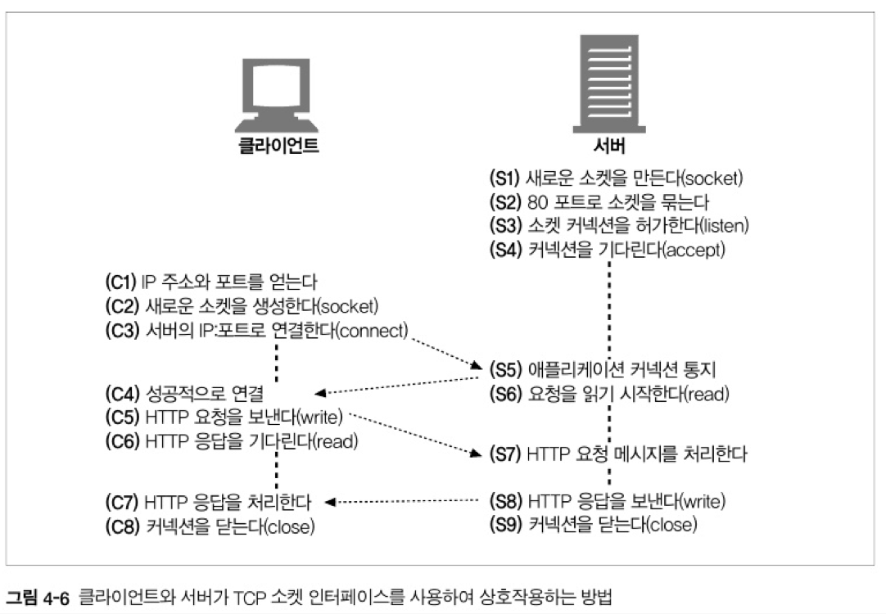

# 4장. 커넥션 관리

<br>

## 소개

<br>

HTTP 애플리케이션을 개발하고 있다면 HTTP 커넥션과 그것이 어떻게 사용되는지에 대해 잘 이해하고 있어야 한다.

해당 장에서는 다음과 같은 내용을 배운다.

- HTTP는 어떻게 TCP 커넥션을 사용하는가

- TCP 커넥션의 지연, 병목, 막힘

- 병렬 커넥션, keep-alive 커넥션, 커넥션 파이프라인을 활용한 HTTP의 최적화

- 커넥션 관리를 위해 따라야 할 규칙들

<br><br>

## 4.1 TCP 커넥션

- 모든 HTTP 통신은 패킷 교환 네트워크 프로토콜들의 계층화된 집합인 TCP/IP를 통해 이루어진다.

- 클라이언트 애플리케이션은 서버 애플리케이션으로 TCP/IP 커넥션을 맺을 수 있다.

- 커넥션이 맺어지면 클라이언트와 서버 컴퓨터 간의 메시지들은 손상되거나 순서가 바뀌지 않고 안전하게 전달된다.

<br>

- 즉, 클라이언트와 서버가 TCP/IP 커넥션을 맺게 되면 주고받는 메시지들이 손상되거나 순서가 바뀌지 않고 안전하게 전달된다. 

<br>

- 예를 들어, 죠의 컴퓨터 가게에서 전동공구의 최신 가격 목록을 가져온다면

<br>

<p align="center"></p>

<br>


1. 호스트 명을 추출
2. 호스트 명에 대한 IP 주소 추출
3. 포트 번호 추출
4. 브라우저가 IP 주소와 포트 번호로 TCP 커넥션을 생성
5. 서버로 HTTP GET 요청 메세지
6. 서버에서 온 응답 메세지 
7. 커넥션 종료

의문점 : 한 요청당 한 TCP 커넥션을 해야 하는가?
<br>

### 4.1.1 신뢰할 수 있는 데이터 전송 통로인 TCP

- TCP 커넥션은 인터넷을 안정적으로 연결해준다.

- TCP는 충돌 없이 순서에 맞게 HTTP 데이터를 전달한다.

<br>

### 4.1.2 TCP 스트림은 세그먼트로 나뉘어 IP 패킷을 통해 전송된다.

- TCP는 IP 패킷이라고 불리는 작은 조각을 통해 데이터를 전송한다.

- HTTP 메세지를 전송할 때 현재 연결된 TCP 커넥션을 통해 메세지 데이터의 내용을 순서대로 보낸다.

<br>

<p align="center"></p>

<br>

- `애플리케이션 계층` 
    
    HTTP 메세지가 생성된다.

- `전송 계층` 

    TCP는 세그먼트라는 단위로 데이터 스트림을 잘게 나눈다.

    세그먼트를 IP 패킷이라고 불리는 봉투에 담아 인터넷을 통해 데이터를 전달한다.
    
    IP 패킷은 특정 IP 주소에서 다른 IP 주소로 전달된다.

    - 해당 패킷은 IP 패킷 헤더, TCP 세그먼트 헤더, TCP 데이터 조각을 포함한다.


<br>

- 이 모든 것은 TCP/IP 소프트웨어에 의해 처리되며 과정은 프로그래머에게 보이지 않는다.

<br>

### IP 패킷

- IP 패킷은 TCP 데이터 스트림의 덩어리를 운반하는 TCP 세그먼트를 실어 나른다.

<br>

<p align="center"></p>

<br>

### 4.1.3 TCP 커넥션 유지하기

- 컴퓨터는 항상 TCP 커넥션을 여러 개 가지고 있다. TCP는 포트 번호를 통해서 여러 개의 커넥션을 유지한다.

- IP 주소는 해당 컴퓨터에 연결되고 포트 번호는 해당 애플리케이션으로 연결된다.

<br>


```
- TCP 커넥션 값

<발신지 IP 주소, 발신지 포트, 수신지 IP 주소, 수신지 포트>
```

<br>

### 4.1.4 TCP 소켓 프로그래밍

- 운영체제는 TCP 커넥션의 생성과 관련된 여러 기능을 제공한다. 

- 소켓 API는 HTTP 프로그래머에게 TCP와 IP의 세부사항을 숨긴다.

<br>

<p align="center"></p>

<br>

- 소켓 API를 사용하면 TCP 종단 데이터 구조를 생성하고, 원격 서버의 TCP 종단에 그 데이터 구조를 연결하여 데이터 스트림을 읽고 쓸 수 있다.

- TCP API는 네트워크 프로토콜의 핸드쉐이킹, TCP 데이터 스트림과 IP 패킷 간의 분할 및 제조립에 대한 모든 세부사항을 외부로부터 숨긴다.

<br>

<p align="center"></p>

<br>

 cf) 소켓이란?

    소켓은 네트워크 상에서 두 프로세스 간의 통신을 가능하게 하는 인터페이스입니다. 소켓은 IP 주소와 포트 번호를 사용하여 두 프로세스를 식별합니다.

    예를 들어, 웹 브라우저에서 웹 페이지를 요청하면 브라우저는 웹 서버에 연결하기 위해 소켓을 사용합니다. 브라우저의 IP 주소와 포트 번호는 웹 서버에 요청을 보내는 데 사용됩니다. 웹 서버는 웹 페이지를 브라우저로 전송하기 위해 자신의 IP 주소와 포트 번호를 사용하여 소켓을 사용합니다.

    소켓은 TCP(Transmission Control Protocol)와 UDP(User Datagram Protocol)라는 두 가지 프로토콜을 사용하여 통신합니다. TCP는 신뢰할 수 있는 연결을 제공하는 반면 UDP는 비신뢰할 수 있는 연결을 제공합니다.

<br><br>

## 4.2 TCP의 성능에 대한 고려

- HTTP는 TCP 바로 위에 있는 계층이기 때문에 HTTP 트랜잭션의 성능은 그 아래 계층인 TCP 성능에 영향을 받는다. 

### 4.2.1 HTTP 트랜잭션 지연

<br>

<p align="center"></p>

<br>

- 트랜잭션을 처리하는 시간은 TCP 커넥션을 설정하고, 요청을 전송하고, 응답 메시지를 보내는 것에 비하면 상당히 짧다.

- 대부분의 HTTP 지연은 TCP 네트워크 지연 때문에 발생한다.

- 다음은 HTTP 트랜잭션을 지연시키는 원인들이다.

    1. 클라이언트는 URI에서 웹 서버의 IP 주소와 포트 번호를 알아내고, 방문한 적이 최근에 없으면 DNS 인프라를 사용하여 IP 주소로 변환할 때 발생하는 시간

    2. 클라이언트는 TCP 커넥션 요청을 서버에게 보내고 서버가 커넥션 허가 응답을 회신할 때 발생하는 시간

    3. 커넥션이 맺어지면 클라이언트는 HTTP 요청을 TCP 파이프를 통해 전송하는 시간 + 웹 서버는 TCP 커넥션에서 요청 메시지를 읽고 처리하며 응답을 보내는 시간

- 이런 TCP 네트워크 지연은 하드웨어 성능, 네트워크와 서버의 전송 속도, 요청과 응답 메시지의 크기, 클라이언트 서버 간의 거리, TCP 프로토콜의 기술적인 복잡성에 따라 크게 달라진다.

### 4.2.2 성능 관련 중요 요소

- HTTP 프로그래머에게 영향을 주는 가장 일반적인 TCP 관련 지연들

    1. TCP 커넥션의 핸드셰이크 설정

    2. 인터넷의 혼잡을 제어하기 위한 TCP의 느린 시작

    3. 데이터를 한데 모아 한 번에 전송하기 위한 네이글 알고리즘

    4. TCP의 편승(piggyback) 확인응답을 위한 확인응답 지연 알고리즘

    5. TIME_WAIT 지연과 포트 고갈

<br>

### 4.2.3 TCP 커넥션 핸드셰이크 지연

<br>

<p align="center"></p>

<br>

- 어떤 데이터를 전송하든 새로운 TCP 커넥션을 열 때면, TCP 소프트웨어는 커넥션을 맺기 위한 조건을 맞추기 위해 연속으로 IP 패킷을 교환한다.

- 작은 크기의 데이터 전송에 커넥션이 사용된다면 패킷 교환은 HTTP 성능을 저하시킬 수 있다.

- TCP 커넥션이 핸드셰이크 하는 순서

    1. 클라이언트는 새로운 TCP 커넥션을 생성하기 위해 작은 TCP 패킷을 서버에게 보낸다. 그 패킷은 'SYN'라는 플래그를 가지는데, 이 요청이 커넥션 생성 요청이라는 뜻이다.

    2. 서버가 커넥션을 받으면 몇 가지 커넥션 매개변수를 산출하고, 커넥션 요청이 받아들여졌음을 의미하는 'SYN'과 'ACK' 플래그를 포함한 TCP 패킷을 클라이언트에게 보낸다.

    3. 마지막으로 클라이언트는 커넥션이 잘 맺어졌음을 알리기 위해 서버에게 다시 확인응답 신호를 보낸다. 오늘날의 TCP는 클라이언트가 이 확인응답 패킷과 함께 데이터를 보낼 수 있다.

<br>

- HTTP 프로그래머는 이 패킷들을 보지 못한다.(패킷들은 보이지 않게 TCP 소프트웨어가 관리한다) HTTP 프로그래머가 보는 것은 새로운 TCP 커넥션이 생성될 때 발생하는 지연이 전부이다.

- HTTP 트랜잭션이 평범한 경우에는 SYN/ SYN+ACK 핸드셰이크가 눈에 띄는 지연을 발생시킨다.

- 크기가 작은 HTTP 트랜잭션은 50% 이상의 시간을 TCP를 구성하는데 쓴다.

<br>

### 4.2.4 확인응답 지연

- 인터넷 자체가 패킷 전송을 완벽하게 보장하지 않기 때문에(인터넷 라우터는 과부하가 걸렸을 때 패킷을 마음대로 파기할 수 있다), TCP는 성공적인 데이터 전송을 보장하기 위해서 자체적인 확인 체계를 가진다.

- 응답 순서

1. 각 세그먼트의 수신자는 세그먼트를 온전히 받으면 확인응답 패킷을 송신자에게 반환한다.

2. 송신자가 특정 시간 안에 확인응답 메시지를 받지 못하면 패킷이 파기되었거나 오류가 있는것으로 판단하고 데이터 다시 전송한다.

3. 확인응답이 같은 방향으로 가는 데이터 패킷에 편승되는 경우를 늘리기 위해 많은 TCP 스택은 확인응답 지연 알고리즘을 구현한다.

4. 확인응답 지연은 송출할 확인응답을 특정 시간동안 버퍼에 저장해두고, 확인응답을 편승시키기 위한 송출 데이터 패킷을 찾는다.(일정 시간안에 송출 데이터 패킷 찾지 못하면 확인응답은 별도 패킷을 만들어 전송)

- 그러나, 요청과 응답 두 가지 형식으로만 이루어지는 HTTP 동작 방식은 확인 응답이 송출 데이터 패킷에 편승할 기회를 감소시킨다. (편승할 패킷을 찾으려고 하면 해당 방향으로 송출될 패킷이 많지 않기 때문에 확인응답 지연 알고리즘으로 인한 지연 자주 발생)

### 4.2.5 TCP 느린 시작(slow start)

- TCP의 데이터 전송 속도는 TCP 커넥션이 만들어진 지 얼마나 지났는지에 따라 달라질 수 있다.

- `TCP 커넥션은 처음에는 커넥션의 최대 속도를 제한하고 속도 제한을 높여나간다.` 이것이 TCP 느린 시작이며, 인터넷의 급작스러운 부하와 혼잡을 방지하는데 쓰인다.

- TCP 느린 시작은 TCP가 한 번에 전송할 수 있는 패킷의 수를 제한한다. 

- 이 혼잡제어 기능 때문에, 새로운 커넥션은 이미 어느 정도 데이터를 주고 받은 커넥션보다 느리다. 그래서 HTTP에는 이미 존재하는 커넥션을 재사용하는 기능이 있다.

<br>

### 4.2.6 네이글(Nagle) 알고리즘과 TCP_NODELAY

- 애플리케이션이 어떤 크기의 데이터든지 TCP 스택으로 전송할 수 있도록 TCP는 데이터 스트림 인터페이스를 제공한다.

- 네이글 알고리즘은 네트워크 효율을 위해서 패킷을 전송하기 전에 많은 양의 TCP 데이터를 한 개의 덩어리로 합친다.

- 네이글 알고리즘의 순서

    1. 네이글 알고리즘은 세그먼트가 최대 크기가 되지 않으면 전송을 하지 않는다.
    
    2. 다만, 다른 모든 패킷이 확인응답을 받았을 경우에는 최대 크기보다 작은 패킷의 전송을 허락한다.
    
    3. 다른 패킷들이 아직 전송 중이면 데이터는 버퍼에 저장된다.

    4. 전송되고 나서 확인응답을 기다리던 패킷이 확인응답을 받았거나 전송하기 충분할 만큼의 패킷이 쌓였을 때 버퍼에 저장되어 있던 데이터가 전송된다.

- 네이글 알고리즘의 문제

    1. 크기가 작은 HTTP 메시지는 패킷을 채우지 못하기 때문에, 앞으로 생길지 모를 추가 데이터를 기다리며 지연될 것이다.

    2. 확인응답 지연과 함께 쓰일 경우 형편없이 동작한다.

- HTTP 애플리케이션은 성능 향상을 위해 HTTP 스택에 TCP_NODELAY 파라미터 값을 설정하여 네이글 알고리즘을 비활성화하기도 한다.

<br>

### 4.2.7 TIME_WAIT의 누적과 포트 고갈

- TCP 커넥션의 종단에서 TCP 커넥션을 끊으면, 종단에서는 커넥션의 IP 주소와 포트 번호를 메모리의 제어 영역에 기록해놓는다.

- 해당 정보는 같은 주소와 포트를 사용하는 새로운 TCP 커넥션이 일정 시간동안 생성되지 않기 위함이다. 이는 이전 커넥션과 관련된 패킷이 그 커넥션과 같은 주소와 포트 번호를 가지는 새로운 커넥션에 삽입되는 문제를 방지한다.

- 만약 이전 커넥션의 패킷이 그 커넥션과 같은 연결 값으로 생성된 커넥션에 삽입되면, 패킷은 중복되고 TCP 데이터는 충돌할 것이다.

- 성능 시험을 하는 상황에서는 가능한 연결의 조합이 제한되며 TIME_WAIT로 인해서 순간순간 포트를 재활용하는 것이 불가능해진다.

- 클라이언트가 서버에 접속할 때마다, 유일한 커넥션을 생성하기 위해 새로운 발신지 포트를 쓰지만 사용할 수 있는 발신지 포트의 수는 제한되어 있고 (60000개 가량) 2MSL초(120초) 동안 커넥션이 재활용될 수 없으므로 초당 500개로 커넥션이 제한된다.

<br><br>

## 4.3 HTTP 커넥션 관리

- HTTP 커넥션 헤더에 대해 알아보고, HTTP 커넥션의 최적화 기술을 알아보자.

#### 4.3.1 흔히 잘못 이해하는 Connection 헤더

- HTTP는 클라이언트와 서버 사이에 프록시 서버, 캐시 서버 등과 같은 중개 서버가 놓이는 것을 허락하며, HTTP 메시지는 클라이언트에서 서버까지 중개 서버들을 거치면서 전달된다.

- Connection 헤더에는 3가지 종류의 토큰이 전달된다.

    1. HTTP 헤더 필드 명은 이 커넥션에만 해당되는 헤더들을 나열한다.

    2. 임시적인 토큰 값은 커넥션에 대한 비표준 옵션을 의미한다.

    3. close 값은 커넥션이 작업이 완료되면 종료되어야 함을 의미한다.

<br>

- 즉, 커넥션 토큰이 HTTP 헤더 필드 명을 가지고 있으면, 해당 필드들은 현재 커넥션만을 위한 정보이므로 다음 커넥션에 전달하면 안된다.

<br>

#### 4.3.2 순차적인 트랜잭션 처리에 의한 지연

- 예를 들어, 3개의 이미지가 있는 웹페이지라면 4개의 HTTP 트랜잭션을 만들어야 한다.

- 하지만 이것이 순차적으로 처리가 된다면 각각 커넥션을 맺는데 발생하는 지연으로 느려질 것이다.

- HTTP 커넥션의 성능을 향상시킬 수 있는 기술들

    1. 병렬 커넥션

    2. 지속 커넥션

    3. 파이프라인 커넥션

    4. 다중 커넥션

<br><br>

## 4.4 병렬 커넥션

<br>

<p align="center"></p>

<br>

- `HTTP는 클라이언트가 여러 개의 커넥션을 맺음으로써 여러 개의 HTTP 트랜잭션을 병렬로 처리`할 수 있게 한다.

### 4.4.1 병렬 커넥션은 페이지를 더 빠르게 내려받는다.

<br>

<p align="center"></p>

<br>

- 단일 커넥션의 대역폭 제한과 커넥션이 동작하지 않는 시간 활용 시, 객체가 여러개 있는 웹 페이지 더 빠르게 내려받을 수 있다.

- 하나의 커넥션으로 객체들을 로드할 때 대역폭 제한과 대기 시간 줄일 수 있다면 더 빠르게 로드 가능하다.

<br>

### 4.4.2 병렬 커넥션이 항상 더 빠르지는 않다.

- 일반적으로 병렬 커넥션이 더 빠르기는 하지만 항상 그렇지는 않다.

- 다수의 커넥션은 메모리를 많이 차지하고 자체적인 성능 문제 발생시킨다.

- 브라우저는 실제로 병렬 커넥션을 사용하긴 하지만 적은 수(대부분 6개 ~ 8개)의 병렬 커넥션만 허용한다.

<br>

### 4.4.3 병렬 커넥션은 더 빠르게 느껴질 수 있다.

- 화면에 여러 개의 객체가 동시에 보이면서 내려받고 있는 상황을 볼 수 있기 때문에 사용자는 더 빠르게 내려받고 있는 것처럼 느낄 수 있다.

<br><br>

## 4.5 지속 커넥션

- 웹 클라이언트는 같은 사이트에 여러 개의 커넥션을 맺는다. 이 속성을 사이트 지역성이라고 부른다.

- HTTP/1.1을 지원하는 기기는 처리가 완료된 후에도 TCP 커넥션을 유지하여 앞으로 있을 HTTP 요청에 재사용할 수 있다. 이러한 상태로 있는 TCP 커넥션을 `지속 커넥션`이라고 한다.

<br>

### 4.5.1 지속 커넥션 vs 병렬 커넥션

- 병렬 커넥션의 장점

    1. 여러 객체가 있는 페이지를 더 빠르게 전송한다.

- 병렬 커넥션의 단점

    1. 각 트랜잭션마다 새로운 커넥션을 맺고 끊기 때문에 시간과 대역폭이 소요된다.

    2. 각각의 새로운 커넥션은 TCP 느린 시작 때문에 성능이 떨어진다.

    3. 실제로 연결할 수 있는 병렬 커넥션의 수에는 제한이 있다.

- 지속 커넥션의 장점

    1. 커넥션을 맺기 위한 사전 작업과 지연을 줄여주고, 튜닝된 커넥션을 유지하며 커넥션 수를 줄여준다.

- 지속 커넥션의 단점

    1. 잘못 관리할 경우, 수많은 커넥션이 쌓이고 로컬 리소스와 원격의 클라이언트와 서버의 리소스에 불필요한 소모를 발생시킨다.

<br>

- 즉, 지속 커넥션과 병렬 커넥션은 함께 사용될 때 가장 효과적이다.

- 오늘날 많은 웹 애플리케이션은 적은 수의 병렬 커넥션을 맺고 그것을 유지한다.

- 두 가지 지속 커넥션 타입

    1. HTTP/1.0+의 keep-alive

    2. HTTP/1.1의 지속

<br>

### 4.5.2 HTTP/1.0+의 Keep-Alive 커넥션

- 1996년 경 다소 실험적이었던 keep-alive 커넥션을 지원하기 위해 확장되었다.

### 4.5.3 Keep-Alive 동작

- 요청에 Connection:Keep-alive 헤더를 포함시킨다. 요청에도 이 커넥션을 통해 받고자 한다면 응답 메시지에 같은 헤더를 포함시켜 응답한다.

### 4.5.4 Keep-Alive 옵션

- Keep-Alive 헤더는 커넥션을 유지하기 바라는 요청일 뿐이다.

- timeout 파라미터로 커넥션이 얼마간 유지될 것인지 정할 수 있다.

- max 파라미터는 커넥션이 몇 개의 HTTP 트랜잭션을 처리할 때까지 유지될 것인가를 의미한다.

    ```
    Connection: Keep-Alive
    Keep-Alive: max=5, timeout=120 
    ```

- 예를 들어, 위의 헤더는 서버가 5개의 추가 트랜잭션이 처리될 동안 커넥션을 유지하거나, 2분 동안 커넥션을 유지하라는 내용의 Keep-Alive 응답 헤더이다.

### 4.5.5 Keep-Alive 커넥션 제한과 규칙

- keep-alive는 HTTP/1.0에서 기본적으로 사용되지는 않아 사용하기 위해 클라이언트는 Connection:Keep-Alive 요청 헤더를 보내야 한다.

- 커넥션이 끊어지기 전에 엔티티 본문의 길이를 알 수 있어야 커넥션 유지할 수 있다.

- 프락시와 게이트웨이는 Connection 헤더의 규칙을 철저히 지켜야 한다. 프락시와 게이트웨이는 메시지 전달, 캐시 넣기 전 Connection 헤더에 명시된 모든 헤더 필드와 Connection 헤더를 제거해야 한다.

### 4.5.6 Keep-Alive와 멍청한(dumb) 프록시

- 오래되고 단순한 수많은 프락시가 Connection 헤더에 대한 처리 없이 요청을 그대로 전달한다.

<br>

<p align="center"></p>

<br>

1. 웹 클라이언트는 프락시에 Connction: Keep-Alive 헤더와 함께 메시지를 보내고 커넥션을 유지하기 요청한다. 클라이언트는 커넥션을 유지하자는 요청이 받아들여졌는지 확인하기 위해 응답을 기다린다.

2. 멍청한 프록시는 요청받은 HTTP의 Connection 헤더를 이해하지 못한다. 그렇기 때문에 한번만 보내져야 하는 Connection 헤더는 서버에 메시지를 그대로 전달한다.

3. 전달된 HTTP 요청이 서버에 도착하고 웹 서버는 프록시가 커넥션을 유지하자고 요청하는 것으로 잘못 판단하고 프록시와 커넥션을 유지하는 것에 동의하고 Connection: Keep-Alive 헤더를 포함해 응답, 하지만 프락시는 keep-alive 이해 못한다.

4. 프록시는 서버로부터 받은 Connection: Keep-Alive 헤더를 포함하고 있는 응답 메시지를 클라이언트에게 전달한다. 클라이언트는 이 헤더를 통해 프록시가 커넥션을 유지하는 것에 동의했다고 추정한다. 이 시점에서 클라이언트와 서버는 커넥션을 유지하고 있다고 생각하지만, 프록시는 keep-alive를 이해하지 못한다.

5. 그래서 프록시는 데이터를 전달하고 서버가 커넥션을 끊기를 기다리지만 유지하기를 요청한 것으로 알고 있기 때문에 커넥션이 끊기지 않는다.

6. 클라이언트도 유지되고 있다고 알고 있기 때문에 커넥션이 유지되고 있는 프록시에 요청을 보낸다. 하지만 프록시는 같은 커넥션 상에서 다른 요청이 오는 경우는 예상하지 못했기 때문에 그 요청은 프록시로부터 무시되고 브라우저는 로드 중이라는 표시만 나온다.

7. 이런 잘못된 통신 때문에, 브라우저는 자신이나 서버가 타임아웃이 나서 커넥션이 끊길 때까지 기다린다.

<br>

- 이런 잘못된 통신을 피하려면 프롟는 Connection 헤더와 Connection 헤더에 명시된 헤더들은 절대 전달하면 안된다.

### 4.5.7 Proxy-Connection 살펴보기

- 중개 서버가 모든 헤더를 무조건 전달하는 문제를 해결하기 위해 Proxy-Connection이라는 헤더를 사용한다.

<br>

<p align="center"></p>

<br>

- Proxy-Connection 헤더가 웹 서버에 전달되더라도 클라이언트와 프록시 사이 혹은 프록시와 서버 사이에 keep-alive 커넥션이 맺어지지 않는데, 영리한 프록시는 Proxy-Connection 헤더가 keep-alive를 요청하는 것을 인식해서 자체적으로 Connection:Keep-Alive 헤더를 웹 서버에 전송한다.

- 하지만 프록시가 많은 구조에서는 Proxy-Connection을 사용하더라도 여전히 문제가 생길 수 있다.

### 4.5.8 HTTP/1.1의 지속 커넥션

- HTTP/1.1에서는 keep-alive 커넥션을 지원하지 않는 대신, 설계가 더 개선된 지속 커넥션을 지원한다.

- 기본으로 활성화 되어 있으며, 모든 커넥션을 지속 커넥션으로 취급한다. Connection: close 헤더가 없으면 계속 유지된다.

### 4.5.9 지속 커넥션의 제한과 규칙

- 클라이언트가 Connection:close 헤더를 포함해 보냈으면 그 커넥션으로 추가적인 요청이 불가하다.

- 클라이언트가 해당 커넥션으로 추가적인 요청 보내지 않을 것이면, Connection:close 헤더를 포함해야 한다.

- 커넥션에 있는 모든 메시지가 자신의 길이 정보를 정확히 가지고 있을 때만 커넥션 지속 가능하다.

<br><br>

## 4.6 파이프라인 커넥션

- HTTP/1.1은 지속 커넥션을 통해서 요청을 파이프라이닝할 수 있다.

- 여러 개의 요청은 응답이 도착하기 전에 큐에 쌓인다. 

- 파이프라인의 제약 사항

    1.  HTTP 클라이언트는 커넥션이 지속 커넥션인지 확인하기 전까지는 파이프라인을 이어서는 안된다.

    2. HTTP 응답은 요청 순서와 같게 와야 한다.

    3. HTTP 클라이언트는 커넥션이 언제 끊어지더라도, 완료되지 않은 요청이 파이프라인에 있으면 언제든 다시 요청을 보낼 준비가 되어 있어야 한다.

    4. POST 요청 같이 서버 데이터의 변화가 있는 요청은 파이프라인을 통해서 보내면 안된다. 에러가 발생하면 파이프라인을 통한 요청 중에 어떤 것들이 서버에서 처리되었는지 알 방법이 없기 때문이다.

<br><br>

## 4.7 커넥션 끊기에 대한 미스터리

- 커넥션 관리(특히 언제 어떻게 커넥션을 끊는가)에는 명확한 기준이 없다.

### 4.7.1 마음대로 커넥션 끊기

- 어떠한 HTTP 클라이언트, 서버, 프록시는 언제든지 TCP 전송 커넥션을 끊을 수 있다. 

- 서버가 유휴 상태(지속 커넥션이 일정 시간동안 요청 전송하지 않고 있음)에 있는 커넥션을 끊는 시점에 서버는 클라이언트가 데이터를 전송하지 않을 것이라 확신하지 못하고, 클라이언트는 요청 메시지를 보내는 도중에 문제 생긴다.

### 4.7.2 Content-Length와 Truncation

- 각 HTTP 응답은 본문의 정확한 크기 값을 가지고 Content-Length 헤더를 가지고 있어야 한다.

- 클라이언트나 프록시가 커넥션이 끊어졌다는 HTTP 응답을 받은 후, 실제 전달된 엔티티의 길이와 Content-Length의 값이 일치하지 않거나, Content-Length가 존재하지 않으면 수신자는 데이터의 정확한 길이를 서버에게 물어봐야 한다.

### 4.7.3 커넥션 끊기의 허용, 재시도, 멱등성

- 커넥션은 에러가 없더라도 끊을 수 있기에, HTTP 애플리케이션은 예상치 못하게 커넥션이 끊어졌을 때 대응할 준비가 되어있어야 한다.

### 4.7.4 우아한 커넥션 끊기

- TCP 커넥션은 양방향이다. 

<br>

<p align="center"></p>

<br>

- 전체 끊기와 절반 끊기

    close(): TCP 커넥션의 입력 채널과 출력 채널의 커넥션 모두 끊음

    shutdown(): 입력 채널이나 출력 채널 중 하나 개별적으로 끊음,
    TCP 끊기와 리셋 에러

- 단순한 HTTP 애플리케이션은 전체 끊기만 사용할 수 있지만, 기기들의 예상치 못한 쓰기 에러를 발생하는 것을 예방하기 위해 절반 끊기를 사용해야 한다.

- 보통 커넥션의 출력 채널을 끊는 것이 안전하며, 커넥션의 반대편에 있는 기기는 모든 데이터를 버퍼로부터 읽고 나서 데이터 전송이 끝남과 동시에 커넥션을 끊었다는 것을 알게 될 것이다.

### 우아하게 커넥션 끊기

- 애플리케이션 자신의 출력 채널을 먼저 끊고 다른 쪽에 있는 기기의 출력 채널이 끊기는 것을 기다리는 것이 우아하게 커넥션 끊는 방법이다.

- 양쪽에서 더는 데이터를 전송하지 않을 것이라고 알려주면 커넥션은 리셋의 위험없이 온전히 종료한다.

## Bard 질문과 답변

### HTTP 1.1 vs HTTP 2.0

```
2023년 11월 8일 현재, 요즘 HTTP는 주로 2.0을 사용합니다. HTTP/2는 HTTP/1.1에 비해 성능이 크게 향상되었기 때문에, 많은 웹사이트와 웹 서비스에서 HTTP/2를 사용하고 있습니다.

Google Chrome, Firefox, Edge, Safari 등 주요 브라우저는 모두 HTTP/2를 지원합니다. 또한, 많은 웹 서버도 HTTP/2를 지원합니다. 예를 들어, Apache, Nginx, IIS 등은 모두 HTTP/2를 지원합니다.

물론, 아직 HTTP/1.1을 사용하는 웹사이트도 있습니다. 특히, 오래된 웹사이트나 작은 웹사이트의 경우 HTTP/2를 지원하지 않을 수 있습니다.

따라서, 요즘 HTTP를 사용할 때는 HTTP/2를 사용하는 것이 좋습니다. HTTP/2를 사용하면 웹 페이지의 로딩 속도를 크게 향상시킬 수 있습니다.

다음은 HTTP/2를 사용하면 얻을 수 있는 이점입니다.

헤더 압축: HTTP/1.1은 요청마다 모든 헤더를 전송해야 하지만, HTTP/2는 요청마다 필요한 헤더만 전송합니다. 이를 통해 헤더 크기를 크게 줄일 수 있습니다.

멀티플렉싱: HTTP/1.1은 하나의 연결에서 하나의 요청만 처리할 수 있지만, HTTP/2는 하나의 연결에서 여러 개의 요청을 동시에 처리할 수 있습니다. 이를 통해 네트워크 자원을 효율적으로 사용할 수 있습니다.

스트림 우선순위: HTTP/2는 각 스트림에 우선순위를 지정할 수 있습니다. 이를 통해 중요한 요청을 빠르게 처리할 수 있습니다.

이러한 이점들로 인해 HTTP/2는 점점 더 많은 웹사이트와 웹 서비스에서 사용되고 있습니다.
```

### 소켓이란?
```
네트워크 통신을 위해서는 두 개의 통신 엔드포인트가 서로의 IP 주소와 포트 번호를 알아야 합니다. IP 주소는 컴퓨터의 위치를 식별하는 주소이고, 포트 번호는 컴퓨터 내에서 실행 중인 프로세스를 식별하는 주소입니다.

소켓은 네트워크 통신을 위한 인터페이스입니다. 소켓을 사용하면 통신 엔드포인트가 서로의 IP 주소와 포트 번호를 교환할 수 있습니다.

소켓을 통해 IP 주소와 포트 번호를 보내는 방법은 다음과 같습니다.

소켓을 생성할 때 IP 주소와 포트 번호를 지정합니다.
소켓을 사용하여 데이터를 전송할 때 IP 주소와 포트 번호를 헤더에 포함합니다.
소켓을 생성할 때 IP 주소와 포트 번호를 지정하면, 소켓이 해당 IP 주소와 포트 번호를 사용하여 데이터를 수신하고 전송할 수 있습니다.

소켓을 사용하여 데이터를 전송할 때 IP 주소와 포트 번호를 헤더에 포함하면, 수신측은 헤더에서 IP 주소와 포트 번호를 확인하여 데이터를 올바른 통신 엔드포인트에 전달할 수 있습니다.

예를 들어, TCP 연결을 설정하기 위해서는 클라이언트가 서버에 SYN 패킷을 전송합니다. SYN 패킷에는 클라이언트의 IP 주소와 포트 번호가 포함되어 있습니다. 서버는 SYN-ACK 패킷을 전송하여 연결을 수락합니다. SYN-ACK 패킷에는 서버의 IP 주소와 포트 번호가 포함되어 있습니다.

이러한 과정을 통해 클라이언트와 서버는 서로의 IP 주소와 포트 번호를 알게 되고, TCP 연결을 설정할 수 있습니다.

TCP 연결을 통해 데이터를 전송할 때는 데이터 패킷에 IP 주소와 포트 번호가 포함되어 있습니다. 수신측은 데이터 패킷의 헤더에서 IP 주소와 포트 번호를 확인하여 데이터를 올바른 통신 엔드포인트에 전달할 수 있습니다.

이러한 방식으로 소켓을 통해 IP 주소와 포트 번호를 보내면, 네트워크 통신 엔드포인트가 서로의 위치와 실행 중인 프로세스를 식별할 수 있습니다.
```

### http2.0에서의 핸드셰이킹
```
HTTP/2에서는 TCP 핸드셰이킹을 잘 사용하지 않습니다. HTTP/2는 TCP 연결을 유지하고 여러 요청을 동시에 처리하는 기능을 제공합니다. 따라서, HTTP/2에서 TCP 핸드셰이킹을 사용하면 네트워크 성능이 저하될 수 있습니다.

HTTP/2에서 TCP 핸드셰이킹을 사용하지 않는 이유는 다음과 같습니다.

연결 유지: HTTP/2는 TCP 연결을 유지하고 여러 요청을 동시에 처리하는 기능을 제공합니다. 따라서, HTTP/2에서 TCP 핸드셰이킹을 사용하면 연결을 새롭게 설정하는 데 필요한 시간을 절약할 수 있습니다.
헤더 압축: HTTP/2는 헤더 압축 기능을 제공합니다. 따라서, HTTP/2에서 TCP 핸드셰이킹을 사용하면 헤더의 크기를 줄일 수 있습니다.
HTTP/2에서 TCP 핸드셰이킹을 사용하지 않는 대신, HTTP/2는 다음과 같은 기능을 제공합니다.

알림: HTTP/2는 알림 기능을 제공합니다. 알림 기능을 사용하면 클라이언트는 서버에 요청을 보내지 않고도 서버의 상태를 확인할 수 있습니다.
스트림: HTTP/2는 스트림 기능을 제공합니다. 스트림 기능을 사용하면 클라이언트는 하나의 TCP 연결에서 여러 요청을 동시에 처리할 수 있습니다.
이러한 기능을 통해 HTTP/2는 TCP 핸드셰이킹을 사용하지 않고도 네트워크 성능을 향상시킬 수 있습니다.
```

### TCP 확인 응답 지연
```
TCP 확인 응답 지연(TCP ACK delay)은 TCP 연결에서 송신측에서 수신측으로 데이터를 전송한 후, 수신측에서 확인 응답(ACK)을 보내는 데 걸리는 시간을 말합니다.

TCP 확인 응답 지연은 다음과 같은 요인에 의해 영향을 받을 수 있습니다.

네트워크 혼잡: 네트워크가 혼잡하면 확인 응답 패킷이 지연될 수 있습니다.
라우팅 지연: 데이터가 전송되는 경로에 라우터가 많으면 확인 응답 지연이 증가할 수 있습니다.
데이터 패킷의 크기: 데이터 패킷의 크기가 크면 확인 응답 패킷의 크기도 커지므로, 확인 응답 지연이 증가할 수 있습니다.
TCP 확인 응답 지연은 네트워크 성능에 영향을 미칠 수 있습니다. 확인 응답 지연이 길수록 송신측은 데이터 전송을 중단하고, 확인 응답을 기다리게 됩니다. 이로 인해 네트워크의 효율성이 저하될 수 있습니다.

TCP 확인 응답 지연을 줄이기 위해서는 다음과 같은 방법을 사용할 수 있습니다.

네트워크 혼잡을 줄이기: 네트워크 혼잡을 줄이기 위해 혼잡 제어 알고리즘을 사용하거나, 적절한 전송률을 설정할 수 있습니다.
라우팅 경로를 최적화하기: 라우팅 경로를 최적화하기 위해 최단 경로 알고리즘을 사용하거나, 라우팅 테이블을 업데이트할 수 있습니다.
데이터 패킷의 크기를 줄이기: 데이터 패킷의 크기를 줄이기 위해 압축이나 암호화 기술을 사용할 수 있습니다.
TCP 확인 응답 지연은 TCP 연결의 성능에 중요한 요소입니다. 확인 응답 지연을 줄이기 위한 적절한 조치를 취함으로써 네트워크 성능을 향상시킬 수 있습니다.
```

### 편승 확인 응답이란?

```
편승 확인용 응답(Piggyback ACK)은 TCP 연결에서 송신측에서 수신측으로 데이터를 전송할 때, 수신측에서 확인 응답(ACK)을 함께 보내는 것을 말합니다.

편승 확인용 응답은 다음과 같은 경우에 사용됩니다.

네트워크 혼잡을 줄이기: 편승 확인용 응답을 사용하면 확인 응답 패킷을 별도로 전송하지 않고, 데이터 패킷과 함께 전송할 수 있습니다. 따라서, 네트워크 혼잡을 줄일 수 있습니다.
전송 효율을 높이기: 편승 확인용 응답을 사용하면 확인 응답 패킷을 전송하기 위해 별도의 전송 시간을 할애할 필요가 없습니다. 따라서, 전송 효율을 높일 수 있습니다.
편승 확인용 응답은 TCP 연결에서 기본적으로 사용되는 기능입니다. 그러나, 다음과 같은 경우에는 편승 확인용 응답을 사용하지 않을 수 있습니다.

데이터 패킷의 크기가 크거나, 데이터 패킷이 빈번하게 전송되는 경우: 데이터 패킷의 크기가 크거나, 데이터 패킷이 빈번하게 전송되는 경우, 확인 응답 패킷의 크기가 커질 수 있습니다. 이 경우, 확인 응답 패킷을 별도로 전송하는 것이 효율적일 수 있습니다.
데이터 패킷의 순서가 중요한 경우: 데이터 패킷의 순서가 중요한 경우, 확인 응답 패킷을 별도로 전송하여 데이터 패킷의 순서를 보장해야 합니다.
편승 확인용 응답은 TCP 연결의 성능을 향상시키는 데 중요한 기능입니다. 편승 확인용 응답을 적절하게 사용함으로써 네트워크 혼잡을 줄이고, 전송 효율을 높일 수 있습니다.
```