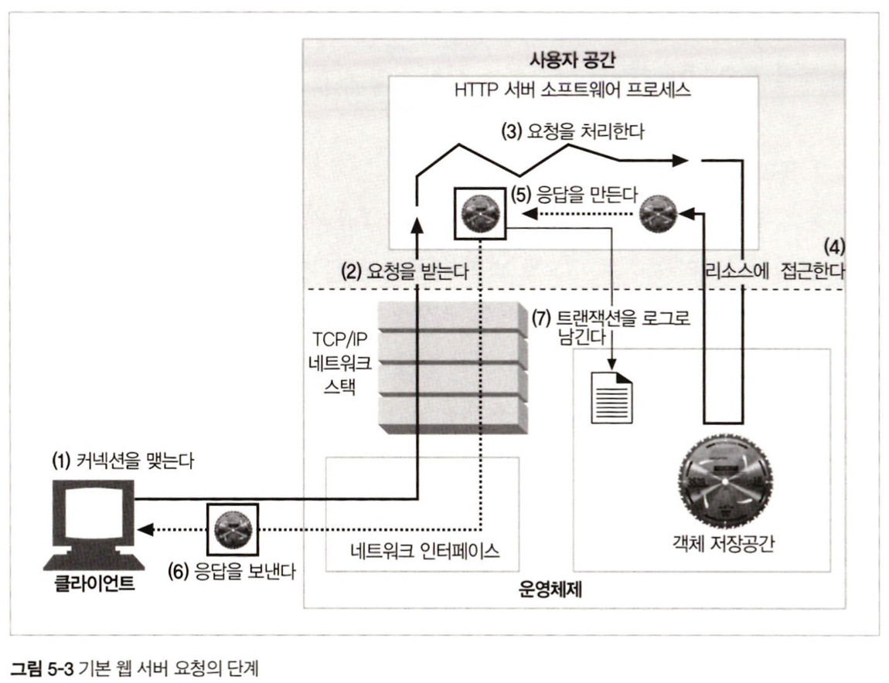
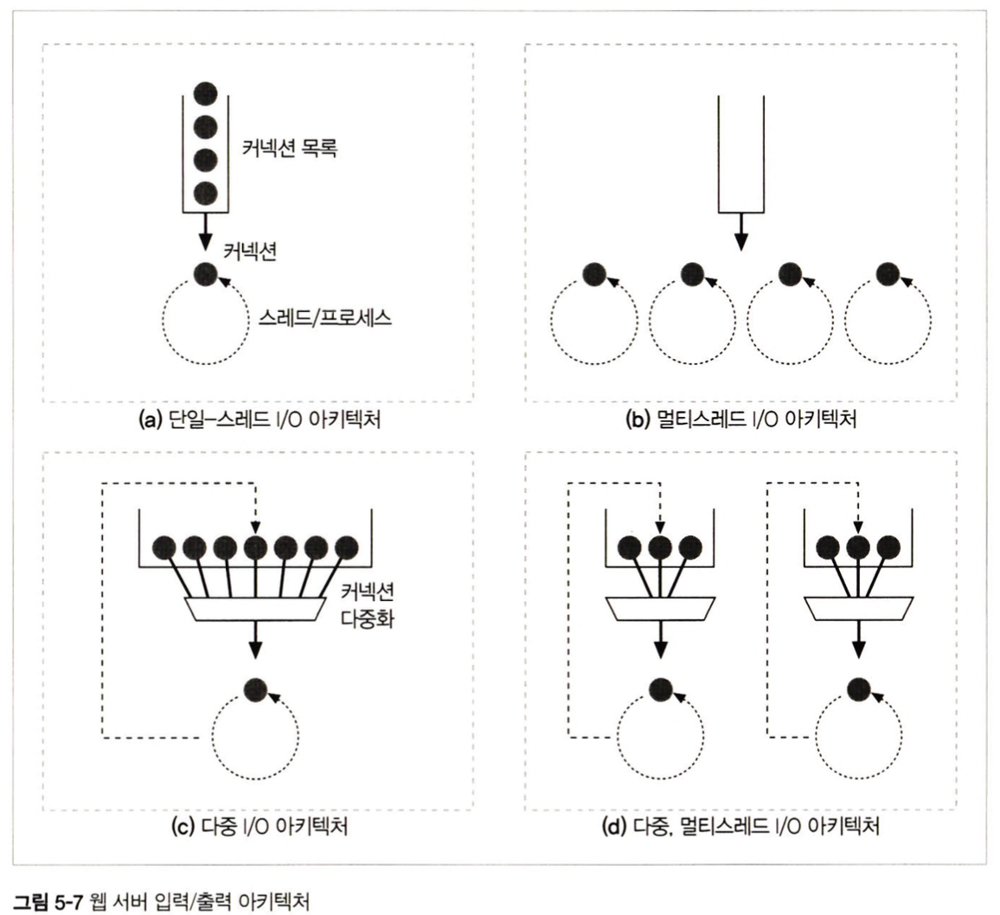
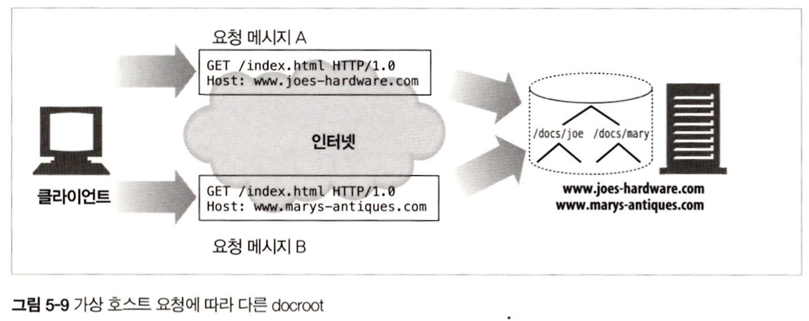

# 5장. 웹 서버

<br>

## 소개

<br>

웹 서버는 월드 와이드 웹의 일꾼이다. 이 장에서 다룰 내용은 다음과 같다.

- 여러 종류의 소프트웨어 및 하드웨어 웹 서버에 대해 조사한다.

- HTTP 통신을 진단해주는 간단한 웹 서버를 펄(Perl)로 작성해본다.

- 어떻게 웹 서버가 HTTP 트랜잭션을 처리하는지 단계별로 설명한다.

<br><br>

## 5.1 다채로운 웹 서버

- 웹 서버라는 용어는 웹 서버 소프트웨어와 웹페이지 제공에 특화된 장비(컴퓨터와 같은) 양쪽 모두를 가리킨다.

- 모든 웹 서버는 리소스에 대한 HTTP 요청을 받아서 콘텐츠를 클라이언트에게 돌려준다.

### 5.1.1 웹 서버 구현

- 웹 서버는 HTTP 및 그와 관련된 TCP 처리를 구현한 것이다.

- 웹 서버는 자신이 제공하는 리소스를 관리하고 웹 서버를 설정, 통제, 확장하기 위한 관리 기능을 제공한다.

- 웹 서버는 TCP 커넥션 관리에 대한 책임을 운영체제와 나눠 갖는다.

- 운영체제는 컴퓨터 시스템의 하드웨어를 관리하고 TCP/IP 네트워크 지원, 웹 리소스를 유지하기 위한 파일 시스템, 현재 연산 활동을 제어하기 위한 프로세스 관리를 제공한다.

### 5.1.2 다목적 소프트웨어 웹 서버

- 다목적 소프트웨어 웹 서버는 네트워크에 연결된 표준 컴퓨터 시스템에서 동작한다.

## 5.2 진짜 웹 서버가 하는 일

1. `커넥션을 맺는다.`

    클라이언트의 접속을 받아들이거나, 원치 않는 클라이언트라면 닫는다.

2. `요청을 받는다.`

    HTTP 요청 메시지를 네트워크로부터 읽어 들인다.

3. `요청을 처리한다.`

    요청 메시지를 해석하고 행동을 취한다.

4. `리소스에 접근한다.`

    메시지에서 지정한 리소스에 접근한다.

5. `응답을 만든다.`

    올바른 헤더를 포함한 HTTP 응답 메시지를 생성한다.

6. `응답을 보낸다.`

    응답을 클라이언트에게 돌려준다.

7. `트랜잭션을 로그로 남긴다.`

    로그파일에 트랜잭션 완료에 대한 기록을 남긴다.

<br><br>

<br>

<p align="center"></p>

<br>


## 5.3 단계 1: 클라이언트 커넥션 수락

- 클라이언트가 이미 서버에 대해 열려있는 지속적 커넥션을 갖고 있다면, 클라이언트는 요청을 보내기 위해 그 커넥션을 사용할 수 있다. 그렇지 않다면, 클라이언트는 서버에 대한 새 커넥션을 열 필요가 있다.

    -> 3 핸드셰이킹 or 4 핸드셰이킹

### 5.3.1 새 커넥션 다루기

1. 클라이언트가 웹 서버에 TCP 커넥션을 요청

2. 웹 서버는 커넥션을 맺고 TCP 커넥션에서 IP 주소를 추출하고, 어떤 클라이언트가 있는지 확인

3. 서버는 새 커넥션을 커넥션 목록에 추가하고 커넥션에서 오가는 데이터를 지켜봄

### 5.3.2 클라이언트 호스트 명 식별

- 대부분의 웹 서버는 역방향 DNS를 사용해서 클라이언트의 IP 주소를 클라이언트의 호스트 명으로 변환하도록 설정되어 있다.

- 호스트명 룩업은 웹 트랜잭션을 느려지게 한다.

### 5.3.3 ident를 통해 클라이언트 사용자 알아내기

- ident 프로토콜은 서버에게 어떤 사용자 이름이 HTTP 커넥션을 초기화했는지 찾아낼 수 있게 해준다. 이 정보는 웹 서버 로깅에 유용하기 때문에 각 HTTP 요청의 ident 사용자 일므을 담고 있다.

```
## Bard 답변

ident 프로토콜은 다음과 같은 단점이 있습니다.

보안이 취약합니다. 원격 호스트는 사용자 이름을 위조할 수 있습니다.

성능이 좋지 않습니다. ident 프로토콜은 원격 호스트의 운영 체제에 부하를 줄 수 있습니다.

ident 프로토콜은 최근에 거의 사용되지 않습니다. 보안과 성능의 문제로 인해 더 안전하고 효율적인 프로토콜로 대체되었습니다.

ident 프로토콜은 다음과 같은 프로토콜로 대체되었습니다.

SASL (Simple Authentication and Security Layer)
KERBEROS (The Kerberos Network Authentication Service)
RADIUS (Remote Authentication Dial-In User Service)

이러한 프로토콜은 ident 프로토콜보다 보안이 좋고 성능이 효율적입니다.
```

<br><br>

## 5.4 단계 2: 요청 메시지 수신

- 커넥션에 데이터가 도착하면, 웹 서버는 네트워크 커넥션에서 그 데이터를 읽어들이고 파싱하여 요청 메시지를 구성한다.

- 요청 메시지를 파싱할 때, 웹 서버는 다음과 같은 일을 한다.

    1. 요청줄을 파싱한다. 요청 메서드, URI, 버전 번호를 찾는다.

    2. 메시지 헤더들을 읽는다.

    3. 헤더의 끝을 의미하는 CRLF로 끝나는 빈 줄을 찾는다.

    4. 요청 본문이 있다면 읽어 들인다.

- 요청 메시지를 파싱할 때, 웹 서버는 입력 데이터를 네트워크로부터 불규칙적으로 받는다. 네트워크 커넥션은 언제든지 무효화될 수 있다.

- 웹 서버는 파싱해서 이해하는 것이 가능한 수준의 분량을 확보할 때까지 데이터를 네트워크로부터 읽어서 메시지 일부분을 메모리에 임시 저장해둘 필요가 있다.


### 5.4.1 메시지의 내부 표현

<br>

<p align="center"></p>

<br>

- 몇몇 웹 서버는 요청 메시지를 쉽게 다룰 수 있도록 내부의 자료 구조에 저장한다.

### 5.4.2 커넥션 입력/출력 처리 아키텍쳐

- 고성능 웹 서버는 수천 개의 커넥션을 동시에 열 수 있도록 지원한다.

- 웹 서버들은 항상 새 요청을 주시하고 있다.

<br>

<p align="center"></p>

<br>

- 단일 스레드 웹 서버

    - 한 번에 하나씩 요청을 처리한다.

    - 트랜잭션이 완료되면, 다음 커넥션이 처리된다.

    - 구현이 쉽지만, 처리 도중에 모든 다른 커넥션은 무시된다.

    - 이는 심각한 성능 문제이므로, 로드가 적은 서버나 진단 도구에서만 사용된다.

- 멀티프로세스와 멀티스레드 웹 서버

    - 여러 요청을 동시에 처리하기 위해 여러 개의 프로세스 혹은 고효율 스레드를 할당한다.

    - 스레드가 미리 생성되는 시스템을 스레드 풀이라고 한다.

    - 동시 커넥션을 처리할 때 많은 메모리나 시스템 리소스를 소비하기 때문에 최대 개수에 제한을 건다.

- 다중 I/O 서버

    - 모든 커넥션은 동시에 그 활동을 감시당한다.

    - 커넥션의 상태가 바뀌면, 그 커넥션에 대해 작은 양의 처리가 수행된다.

    - 그 처리가 완료되면 커넥션은 다음번 상태 변경을 위해 열린 커넥션 목록으로 돌아간다.

    - 커넥션이 작업을 수행하는 것은 실제로 해야 할 일이 있을 때이므로 스레드와 프로세스는 유휴 상태의 커넥션을 기다릴 필요가 없다.

- 다중 멀티스레드 웹 서버

    - 멀티스레딩과 다중화를 결합한다.

    - 여러 개의 스레드는 열려 있는 커넥션을 감시하고 각 커넥션에 대해 조금씩 작업을 수행한다.


```
## 다중 I/O 아키텍쳐 vs 다중 멀티스레드 I/O 아키텍쳐

다중 I/O 아키텍쳐는 하나의 프로세스나 스레드가 여러 개의 I/O 작업을 동시에 수행할 수 있도록 하는 아키텍쳐이지만, 하나의 프로세스 내에서만 수행할 수 있습니다. 반면, 다중 멀티스레드 I/O 아키텍쳐는 하나의 프로세스 내에서 여러 개의 스레드가 동시에 여러 개의 I/O 작업을 수행할 수 있기 때문에, 다중 I/O 아키텍쳐보다 성능을 더 향상시킬 수 있습니다.
```

## 5.5 단계 3: 요청 처리

- 웹 서버가 요청을 받으면, 요청으로부터 메서드, 리소스, 헤더, 본문을 얻어 처리한다.

## 5.6 단계 4: 리소스의 매핑과 접근

- 웹 서버는 리소스 서버이다. 정적 콘텐츠와 동적 콘텐츠를 제공한다.

### 5.6.1 Docroot

- 웹 서버는 여러 종류의 리소스 매핑을 지원한다.

- 가장 단순한 형태는 요청 URI를 웹 서버의 파일 시스템 안에 있는 파일 이름으로 사용하는 것이다.

- 일반적으로 웹 서버 파일 시스템의 특별한 폴더를 docroot라고 부른다.

- 웹 서버는 요청 메시지에서 URI르 가져와서 docroot 뒤에 붙인다.

<br>

<p align="center"></p>

<br>


### 가상 호스팅된 docroot

-  가상 호스팅 웹 서버는 각 사이트에 그들만의 분리된 문서 루트를 주는 방법으로 한 웹 서버에서 여러 개의 웹 사이트를 호스팅한다.

- 하나의 웹 서버 위에서 두 개의 사이트가 완전히 분리된 콘텐츠를 갖고 호스팅 되도록 할 수 있다.

### 사용자 홈 디렉터리 docroots

- 사용자들이 한 대의 웹 서버에서 각자의 개인 웹 사이트를 만들 수 있도록 해준다.

<br>

### 5.6.2 디렉터리 목록

- 웹 서버는 디렉터리 URL에 대한 요청을 받을 수 있다.

- 에러를 반환하거나, 색인 파일을 반환하거나, 디렉터리를 탐색해서 그 내용을 담은 HTML 페이지를 반환한다.

### 5.6.3 동적 콘텐츠 리소스 매핑

- 웹 서버는 URL를 동적 리소스에 매핑할 수도 있다. 요청에 맞게 콘텐츠를 생성하는 프로그램에 URI를 매핑하는 것이다.

- 어떤 리소스가 동적 리소스라면 애플리케이션 서버는 동적 콘텐츠 생성 프로그램이 어디 있는지, 어떻게 실행하는지를 알려줄 수 있어야 한다.

```
## CGI란?
CGI는 Common Gateway Interface의 약자로, 웹 서버와 웹 애플리케이션 간의 인터페이스를 정의하는 표준입니다. CGI를 통해 웹 서버는 웹 애플리케이션을 호출하고, 웹 애플리케이션은 웹 서버를 통해 클라이언트에게 응답할 수 있습니다.

CGI는 다음과 같은 방식으로 작동합니다.

1. 클라이언트가 웹 서버에 요청을 보냅니다.
2. 웹 서버는 요청을 처리하기 위해 CGI 스크립트를 호출합니다.
3. CGI 스크립트는 클라이언트의 요청을 처리하고, 결과를 웹 서버에 반환합니다.
4. 웹 서버는 결과를 클라이언트에게 반환합니다.

CGI는 다음과 같은 장점이 있습니다.

확장성이 뛰어납니다. 다양한 언어와 프레임워크로 개발된 웹 애플리케이션을 사용할 수 있습니다.
관리가 간편합니다. 웹 애플리케이션을 별도의 서버에서 실행할 수 있으므로, 웹 서버의 관리 부담을 줄일 수 있습니다.

CGI는 다음과 같은 단점이 있습니다.

성능이 저조할 수 있습니다. CGI 스크립트는 웹 서버와 웹 애플리케이션 간의 통신을 위해 별도의 프로세스를 생성하므로, 성능이 저조할 수 있습니다.
보안이 취약할 수 있습니다. CGI 스크립트는 웹 서버의 권한으로 실행되므로, 보안이 취약할 수 있습니다.

따라서, CGI를 사용할 경우, 성능과 보안을 고려하여 사용해야 합니다.

CGI는 웹 애플리케이션을 개발하기 위한 표준으로, 현재에도 다양한 분야에서 사용되고 있습니다.
```


### 5.6.4 서버사이드 인클루드 (SSI)

- 서버에 콘텐츠에 변수 이름이나 내장된 스크립트가 될 수 있는 어떤 특별한 패턴이 있으면 변수 값이나 실행 가능한 스크립트의 출력 값으로 치환된다.

<br><br>

## 5.7 단계 5: 응답 만들기

- 서버가 리소스를 식별하면, 서버는 요청 메서드로 서술되는 동작을 수행한 뒤 응답 메시지를 반환한다.

### 5.7.1 응답 엔터티

- 트랜잭션이 응답 본문을 생성한다면, 응답 메시지와 함께 돌려보내야 한다.

### 5.7.2 MIME 타입 결정하기

- 웹 서버는 응답 본문의 MIME 타입을 결정해야 한다.

    1. mime.types

        파일 이름의 확장자를 사용할 수 있다. 가장 흔한 방법이다.

    2. 매직 타이핑

        파일 내용을 검사해서 알려진 패턴에 대한 테이블(매직 파일)에 해당하는 패턴이 있는지 찾아본다.

        표준 확장자 없이 이름이 지어진 경우 편리하다.

    3. 유형 명시

        특정 파일이나 디렉터리 안의 파일들이 확장자나 내용에 관계없이 특정한 MIME 타입을 갖도록 설정할 수 있다.

    4. 유형 협상

        한 리소스가 여러 종류의 문서 형식에 속하도록 설정할 수 있다.

### 5.7.3 리다이렉션

- 웹 서버는 종종 성공 메시지 대신 리다이렉션 응답을 반환한다. 3XX 상태 코드로 지칭된다. 

- Location 응답 헤더에 URI를 포함한다.

- 리다이렉트의 사용 방식

    1. 영구히 리소스가 옮겨진 경우

    2. 임시로 리소스가 옮겨진 경우

    3. URL 증강

        문맥 정보를 포함시키기 위해 재 작성된 URL로 리다이렉트

    4. 부하 균형

    5. 친밀한 다른 서버가 있을 때

    6. 디렉터리 이름 정규화

<br><br>

## 5.8 단계 6: 응답 보내기

- 서버는 여러 클라이언트와 많은 커넥션을 가질 수 있다. 커넥션 상태를 계속 추적해야 하며, 지속적인 커넥션은 주의해서 다뤄야 한다.

## 5.9 단계 7: 로깅

- 마지막으로 트랜잭션이 완료되었을 때 웹 서버는 트랜잭션이 어떻게 수행되었는지에 대한 로그를 로그파일에 기록한다.