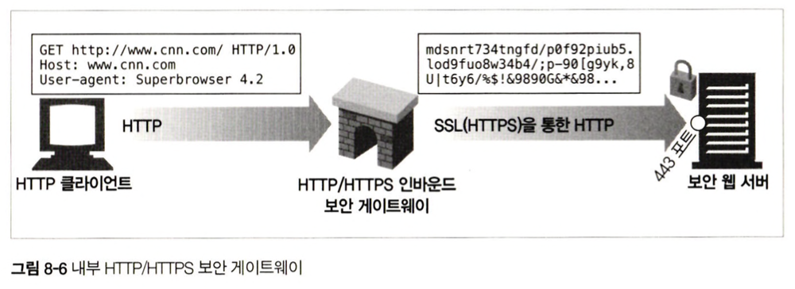
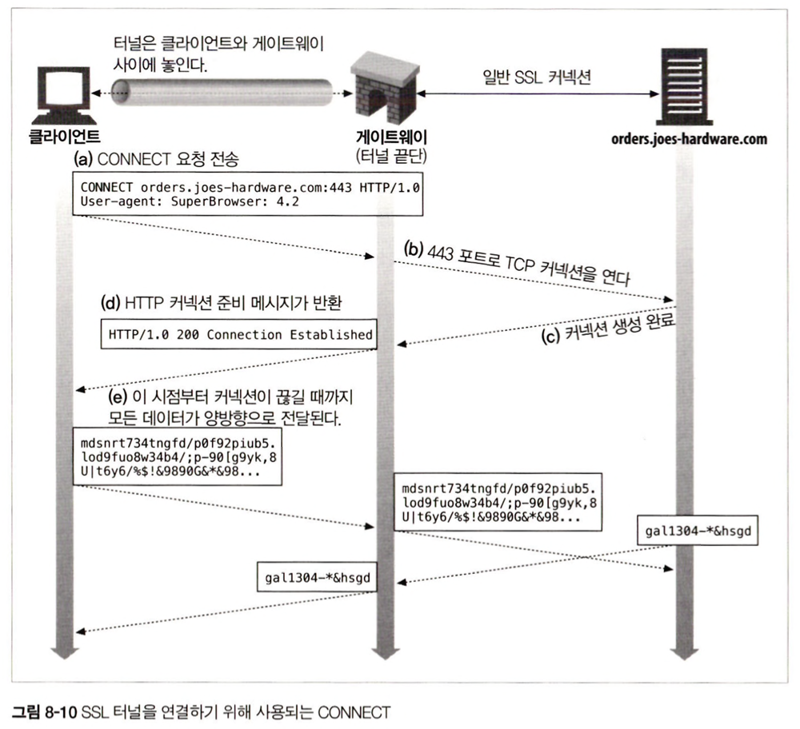
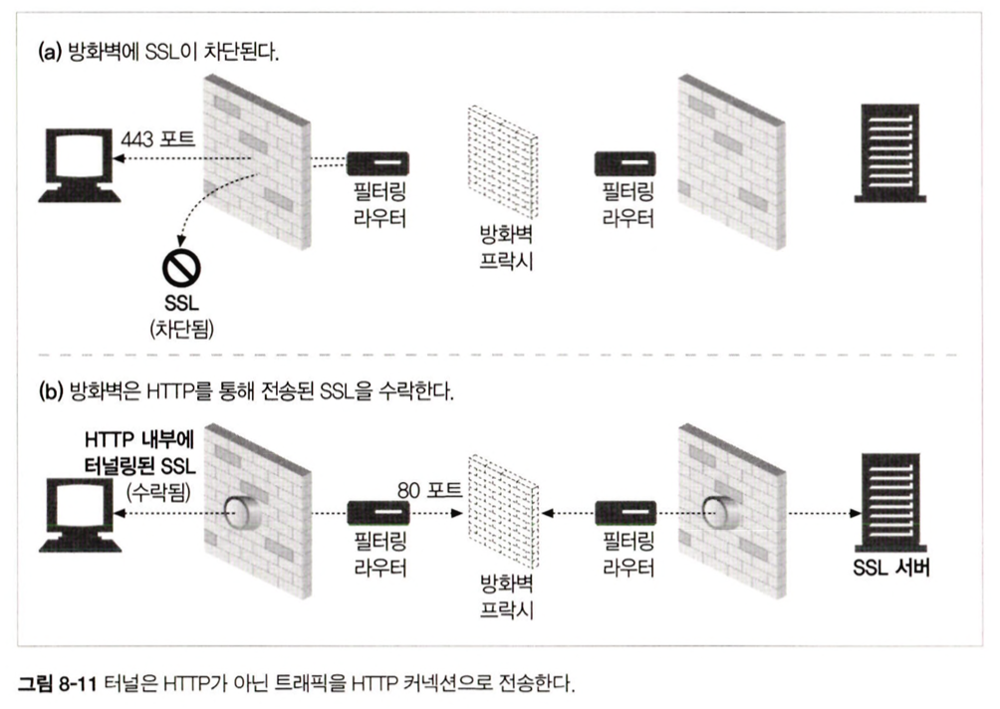
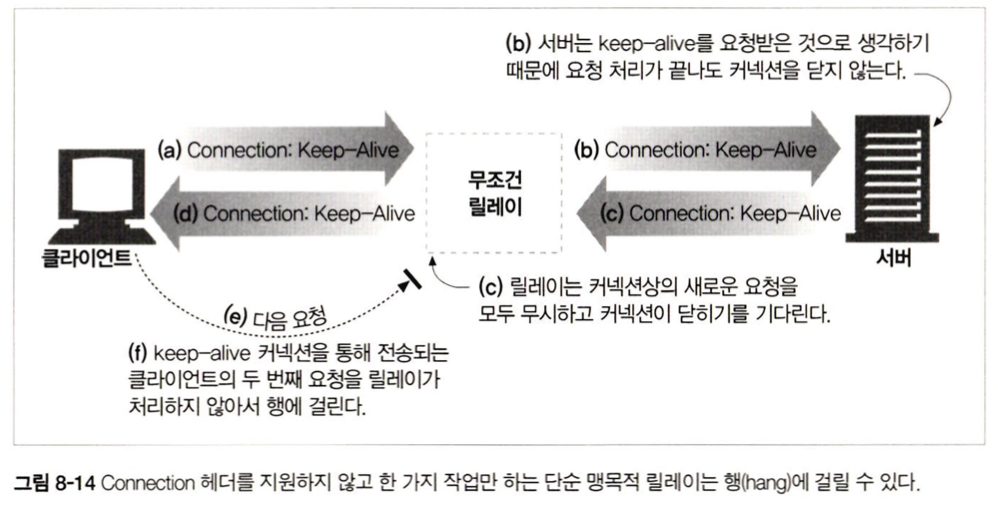

# 8장. 통합점: 게이트웨이, 터널, 릴레이

<br>

## 소개

<br>

시간이 지나면서 사람들은 온라인에 단순 정적 문서뿐만 아니라 더운 복잡한 리소스(데이터베이스 콘텐츠나 동적으로 생성된 HTML 페이지)를 공유하기 원했다.

브라우저 같은 HTTP 애플리케이션은 인터넷상의 콘텐츠에 접근하는 통일한 방법을 제공한다.

HTTP 위에 다른 프로토콜을 얹으려고 하는 개발자들에게는 HTTP 가 기본 구성 요소이다.

예를 들어, HTTP만 허용하는 방화벽이 있는 회사에서 다른 프로토콜로 통신하는 트래픽을 HTTP로 감싸서 터널링하거나 릴레이 하는 것이다.

HTTP는 웹에 있는 모든 리소스에 대한 프로토콜로 사용되었으며, 애플리케이션 간에 서로 다른 프로토콜을 상호 운용하는 용도로 사용하기도 한다.

이 장에서는 여러 종류의 리소스에 접근하는데 HTTP가 어떻게 쓰이는지 알아보고, 다른 프로토콜이나 애플리케이션 간 통신에 HTTP를 어떻게 사용하는지 알아볼 것이다.

1. 게이트웨이 : 서로 다른 프로토콜과 애플리케이션 간의 HTTP 인터페이스
2. 애플리케이션 인터페이스 : 서로 다른 형식의 웹 애플리케이션이 통신하는 데 사용
3. 터널 : HTTP 커넥션을 통해서 HTTP가 아닌 트래픽을 전송하는 데 사용
4. 릴레이 : 일종의 단순한 HTTP 프락시로 한 번에 한 개의 홉에 데이터를 전달하는 데 사용

<br><br>

## 8.1 게이트웨이

- HTTP의 확장과 인터페이스는 사람들의 필요에 따라 발전해왔다. 웹에 더 복잡한 리소스를 올려야 할 필요가 생기면서 모든 리소스를 한 개의 애플리케이션으로만 처리할 수 없다는 것은 분명해졌다.

- 개발자들은 인터프리터 같이 리소스를 받기 위한 경로를 안내하는 역할을 하는 게이트웨이를 고안해냈다.

- `게이트웨이는 리소스와 애플리케이션을 연결하는 역할`을 한다.

- 게이트웨이는 HTTP 트래픽을 다른 프로토콜로 자동으로 변환하여 HTTP 클라이언트가 다른 프로토콜을 알 필요없이 서버에 접속할 수 있게 한다.

### 8.1.1 클라이언트 측 게이트웨이와 서버 측 게이트웨이

- 웹 게이트웨이는 한쪽에서는 HTTP로 통신하고 다른 한 쪽에서는 HTTP가 아닌 다른 프로토콜로 통신한다.

- 서버 측 게이트웨이는 클라이언트와 HTTP로 통신하고, 서버와는 외래 프로토콜로 통신한다.

- 클라이언트 측 게이트웨이는 클라이언트와 외래 프로토콜로 통신하고, 서버와는 HTTP로 통신한다.

```
참고

상이한 HTTP 버전 사이에서 변환을 수행하는 웹 프락시는 게이트웨이와 같다. 그 웹 프락시는 양쪽 사이에서 교섭을 위한 복잡한 로직을 수행하기 때문이다. 하지만 양쪽에서 HTTP로 통신하기 때문에 기술적으로는 프락시이다.
```

## 8.2 프로토콜 게이트웨이

- 프락시에 트래픽을 바로 보내는 것과 같이 게이트웨이에도 HTTP 트래픽을 바로 보낼 수 있다.

- 보통 브라우저에 명시적으로 게이트웨이를 설정하여 자연스럽게 트래픽이 게이트웨이를 거쳐 가게 하거나, 게이트웨이를 대리 서버(리버스 프락시)로 설정할 수도 있다.

### 8.2.1 HTTP/*: 서버 측 웹 게이트웨이

- 서버 측 웹 게이트웨이는 클라이언트로부터 HTTP 요청이 원 서버 영역으로 들어오는 시점에 클라이언트 측의 HTTP 요청을 외래 프로토콜로 전환한다.

<br>

<p align="center"></p>

<br>

### 8.2.2 HTTP/HTTPS: 서버 측 보안 게이트웨이

- 기업 내부의 모든 웹 요청을 암호화함으로써 개인 정보 보호와 보안을 제공하는데 게이트 웨이를 사용할 수 있다.

<br>

<p align="center"></p>

<br>

### 8.2.3 HTTPS/HTTP: 클라이언트 측 보안 가속 게이트웨이

- 보안 HTTPS 트래픽을 받아서 복호화하고, 웹 서버로 보낼 일반 HTTP 요청을 만든다.

- 이 경우 게이트웨이와 원 서버 간의 암호화하지 않은 트래픽을 전송하기 때문에, 게이트웨이와 원 서버 간에 있는 네트워크가 안전한지 확인을 하고 사용해야 한다.

<br>

<p align="center"></p>

<br>

## 8.3 리소스 게이트웨이

- 게이트웨이의 가장 일반적인 형태인 애플리케이션 서버는 목적지 서버와 게이트웨이를 한 개의 서버로 결합한다.

- 애플리케이션 서버는 게이트웨이의 애플리케이션 프로그래밍 인터페이스(API)를 통해서 요청을 서버에서 동작하고 있는 애플리케이션에 전달한다.

- 애플리케이션 게이트웨이에서 유명했던 최초의 API는 CGI(공용 게이트웨이 인터페이스)이다.

- CGI는 특정 URL에 대한 HTTP 요청에 따라 프로그램을 실행하고, 프로그램의 출력을 수집하고, HTTP 응답으로 회신하는데 웹 서버가 사용하는 표준화된 인터페이스 집합이다.

<br>

<p align="center"></p>

<br>

### 8.3.1 공용 게이트웨이 인터페이스

- CGI는 최초의 서버 확장이자 지금까지도 가장 널리쓰이는 서버 확장이다. 이는 웹에서 동적인 HTML, 신용카드 처리, 데이터베이스 질의 등을 제공하는데 쓰인다.

- CGI가 내부에서 어떤 처리를 하는지는 사용자에게 보이지 않는다. 사용자의 시각에서는 CGI가 내부적으로 일반적인 요청을 만드는 것일 뿐이다.

### 8.3.2 서버 확장 API

- CGI 프로토콜은 구동 중인 HTTP 서버에 외부 인터프리터가 쉽게 접속할 수 있게 해주지만, 서버 자체의 동작을 바꾸고 싶거나 서버의 처리 능력을 올리고자 할 때는 어떻게 할까?

- 확장 API로 해결하였다. 이러한 맞춤 인터페이스는 개발자에게 매우 유용하다.

## 8.4 애플리케이션 인터페이스와 웹 서비스

- 애플리케이션을 연결하면서 생기는 까다로운 이슈 중 하나는, 데이터를 교환하려는 두 애플리케이션 사이에서 프로토콜 인터페이스를 맞추는 일이다.

- 과거에는 SOAP을 통해 XML을 사용하여 정보를 교환했지만 현대 웹 서비스의 데이터 교환 방식은 REST 방식을 더 많이 쓰며 JSON을 주로 사용한다.


## 8.5 터널

- 웹 터널은 HTTP 프로토콜을 지원하지 않는 애플리케이션에 HTTP 애플리케이션을 사용해 접근하는 방법을 제공한다.

- 웹 터널을 사용하면 HTTP 커넥션을 통해서 HTTP가 아닌 트래픽을 전송할 수 있고, 다른 프로토콜을 HTTP 위에 올릴 수 있다.

- 따라서 웹 터널을 사용하면 웹 트래픽만을 허락하는 방화벽이 있더라도 HTTP가 아닌 트래픽을 전송할 수 있다.


### 8.5.1 CONNECT로 HTTP 터널 커넥션 맺기


- 웹 터널은 HTTP의 CONNECT 메서드를 사용하여 커넥션을 맺는다.

- CONNECT 메서드는 터널 게이트웨이가 임의의 목적 서버와 포트에 TCP 커넥션을 맺고 클라이언트와 서버 간에 오는 데이터를 무조건 전달하기를 요청한다.

<br>

<p align="center"></p>

<br>

### 8.5.2 데이터 터널링, 시간, 커넥션 관리

- 터널을 통해 전달되는 데이터는 게이트웨이에서 볼 수 없어서, 게이트웨이는 패킷의 순서나 흐름에 대한 어떤 가정도 할 수 없다. 

### 8.5.3 SSL 터널링

- 웹 터널은 원래 방화벽을 통해서 암호화된 SSL 트래픽을 전달하려고 개발되었다.

<br>

<p align="center"></p>

<br>

- 터널을 사용하면 SSL 트래픽을 HTTP 커넥션으로 전송하여 80 포트의 HTTP만을 허용하는 방화벽을 통과시킬 수 있다.


<br>

<p align="center"></p>

<br>

- (a)를 보면 SSL 트래픽이 기존 프락시 방화벽을 통과할 수 있또록 HTTP에 터널링 기능이 추가되었다. 

- 이 터널링 기능은 HTTP 메세지에 암호화된 날 데이터를 담고 일반 HTTP 채널을 통해 데이터를 전송한다.

- (b)를 보면 SSL 트래픽은 일반 SSL 커넥션을 통해 전송되기 전까지는 HTTP 메시지에 담겨 HTTP 포트인 80에 전송된다.

### 8.5.4 SSL 터널링 vs HTTP/HTTPS 게이트웨이

- HTTPS 프로토콜은 다른 프로토콜과 같은 방식으로 게이트웨이를 통과할 수 있다.

- 원격 HTTPS 서버와 SSL 세션을 시작하는 게이트웨이(클라이언트 대신)를 두고 클라이언트 측의 HTTPS 트랜잭션을 수행하는 방식이다.

- 응답은 프락시가 받아서 복호화하고 난 후에 HTTP를 통해 클라이언트로 전송한다. 

- 이것의 단점은 클라이언트-게이트웨이 사이에는 보안이 적용되지 않은 일반 HTTP 커넥션이 맺어져 있다.

<br>

- 하지만 이 상황에서 SSL 터널링을 사용하면 프락시에 SSL을 구현할 필요가 없다.

## 8.6 릴레이

- HTTP 릴레이는 HTTP 명세를 완전히 준수하지는 않는 간단한 HTTP 프락시이다. 
  
- 릴레이는 커넥션을 맺기 위한 HTTP 통신을 한 다음, 바이트를 맹목적으로 전달한다.

- 해당 방식이 유용할 때가 있지만, 잠재적으로 심각한 상호 운용 문제를 가지고 있기에 주의해야 한다.

<br>

<p align="center"></p>

<br>

- 해당 그림은 맹목적 릴레이가 Connection 헤더를 제대로 처리하지 못해서 keep-alive 커넥션이 행에 걸리는 것이다.

1. 웹 클라이언트는 Connection: Keep-Alive 헤더를 보내서, 릴레이에 keep-alive 커넥션을 맺기를 원한다는 내용의 요청 메시지를 전송한다. 릴레이가 HTTP 요청을 받지만 Connection 헤더를 이해하지 못하므로, 요청을 단순히 서버로 넘긴다. 하지만 Connection 헤더는 홉과 홉 사이에만 사용하는 헤더이다. 이는 단일 전송 링크만을 지원하고 체인을 따라 전달할 수 없다.

2. 릴레이된 HTTP 요청이 웹 서버에 도착한다. 웹 서버가 Keep-alive 헤더를 받으면 보통 클라이언트가 서버에게 하는 것처럼 릴레이가 keep-alive를 하기 바란다고 잘못된 결론을 내린다.

3. 이 시점부터 웹 서버는 릴레이와 함께 keep-alive 통신을 하고, keep-alive의 규칙에 맞게 동작하지만 릴레이는 keep-alive에 대해 아무것도 모른다.

4. 릴레이는 웹 서버로부터 받은 Keep-Alive 헤더를 포함한 응답 메시지를 클라이언트에게 전달하지만 클라이언트는 릴레이와 keep-alive로 통신하는 것에 동의했다고 착각한다.

  

