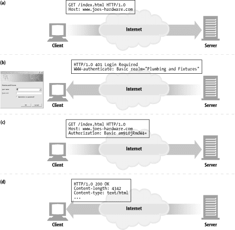
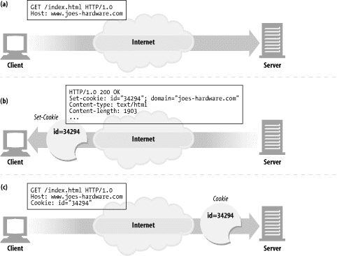
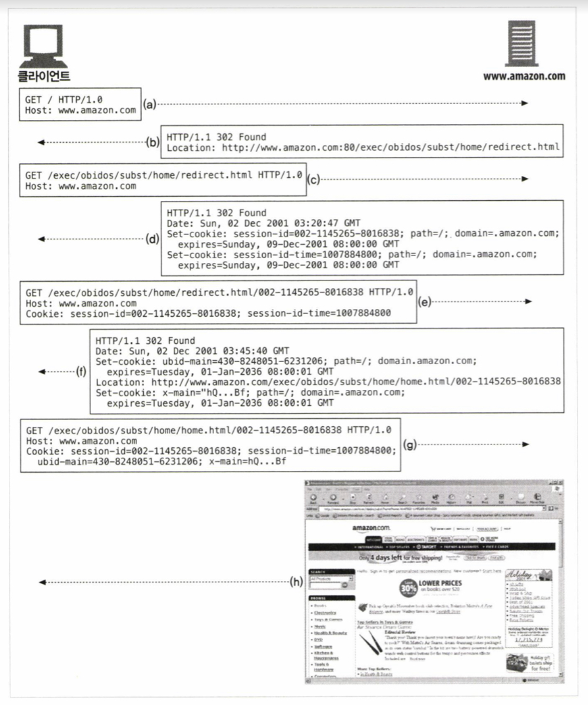

# 11장. 클라이언트 식별과 쿠키

<br>

## 소개

<br>

웹 서버는 서로 다른 수천 개의 클라이언트들과 동시에 통신한다. 

이 서버들은 익명의 클라이언트로부터 받는 모든 요청을 처리하는 것뿐만 아니라 서버와 통신하고 있는 클라이언트를 추적해야 할 수도 있다.

이 장에서는 서버가 통신하는 대상을 식별하는 데 사용하는 기술을 알아본다.

<br>

## 11.1 개별 접촉

- HTTP의 특징

    - 익명이다.

    - 상태가 없다.

    - 요청과 응답으로 통신한다.
  
- 웹 서버는 사용자를 식별하거나, 연속적인 요청을 추적하기 위해서는 약간의 정보가 필요하다.

- 개인화 예시

    - 개별 인사 (ex. 우빈 님, 안녕하세요?)
    
    - 사용자 맞춤 추천
    
    - 주소, 신용카드 정보 입력 자동화 (cf. DB에 저장하기도 함)
    
    - 세션 추적 (ex. 장바구니)

<br>

## 11.2 HTTP 헤더

- Form
  
    - 사용자의 이메일 주소

- User-Agent
 
    - 사용자의 브라우저의 이름과 버전 정보

- Referer
  
    - 사용자가 현재 링크를 타고 온 근원 페이지
    
    - 사용자의 웹 사용 행태나 사용자의 취향을 파악할 수  있음

- 나머지는 다음 절에서 다룸

<br>

## 11.3 클라이언트 IP 주소

- 사용자 식별에 클라이언트 IP 주소 사용한다.

- 보통 HTTP 헤더에 IP 주소가 들어가지는 않지만 웹 서버 HTTP 요청을 보내는 반대쪽 TCP 커넥션의 IP 주소를 알아낼 수 있다.

### 클라이언트 IP 주소의 단점

- IP 주소는 사용자가 아니라 컴퓨터를 가리킨다. 여러 사용자가 같은 컴퓨터를 사용할 수 있다.

- 인터넷 서비스 제공자(ISP)는 동적으로 IP 주소를 할당한다. 사용자는 매번 다른 주소를 받으므로, 웹 서버는 사용자는 IP 주소로 식별할 수 없다.
  
- 많은 사용자가 네트워크 주소 변환(NAT) 방화벽을 통해 인터넷을 사용한다. NAT 장비들은 클라이언트들의 실제 IP 주소를 하나의 방화벽 IP 주소로 변환한다.
  
- 서버가 프락시나 게이트웨이와 연결되어 있는 경우, 서버는 클라이언트의 IP 주소 대신 프락시의 IP 주소를 본다. (프락시 확장 헤더(Client-ip, X-Forwarded-For)를 사용할 수도 있지만 모든 프락시가 그렇게 하지는 않는다.)

<br>

- 아직도 세션 간에 사용자를 추적하려고 클라이언트 IP 주소를 사용하는 웹사이트가 있지만, 이 방식은 제대로 동작하지 않기 때문에 사용하지 않는다.

## 11.4 사용자 로그인

<br>

<p align="center"></p>

<br>

1. 클라이언트가 요청

2. 서버는 401 Login Required 응답과 WWW-Authenticate 헤더를 반환해 로그인 요청

3. 사용자가 입력한 로그인 정보 토큰 Authorization 헤더에 담아 보냄 (ex. Authorization: Basic am910jRmdW4=)

4. 추후 요청에 대해서는 서버가 요청하지 않아도 사용자 이름과 비밀번호를 포함해 전달해 세션이 진행되는 내내 사용자에 대한 식별을 유지함

- 사용자 로그인의 문제점은 사이트를 옮길 때마다 각 사이트에 로그인을 해야 하는 것과 서로 다른 사용자 이름과 비밀번호를 기억해야 한다는 것이다.


## 11.5 뚱뚱한 URL

- 사용자가 처음 방문하면 유일한 ID가 생성되며 URL 처음이나 끝에 ID를 추가한다. 
  
    - ex. <vv>http<vv>://amazon.com/.../002-1145265-801683

- 서버가 ID를 포함한 요청을 받으면 사용자와 관련된 추가적인 정보(ex. 장바구니, 프로필)를 찾고, 응답을 뚱뚱한 URL로 만든다.

### 뚱뚱한 URL의 문제점

- 못생긴 URL
  
    - URL이 못생겨서 사용자에게 혼란을 준다.

- 공유하지 못하는 URL
    
    - 공유하면 뚱뚱한 URL에 담긴 개인정보가 같이 공유된다.
  
- 캐시 접근 불가
 
    -  URL이 계속 달라지기 때문에 캐시를 사용할 수 없다.

- 서버 부하 증가
  
    - 뚱뚱한 URL에 해당하는 각 페이지들을 새로 그려야 한다.

- 이탈
     
  - 사용자가 뚱뚱한 URL 세션에서 이탈하기 쉽다.

- 세션 간 지속성의 부재
  
  - 사용자가 뚱뚱한 URL을 북마크하지 않는 이상 로그아웃하면 모든 정보를 잃는다.

<br>

## 11.6 쿠키

- 사용자를 식별하고 세션을 유지하는 방식 중 가장 널리 사용되는 방식이다.
  
- 매우 중요한 웹 기술일 뿐 아니라 새로운 HTTP 헤더를 정의한다.

- 쿠키와 캐시가 충돌할 수 있어서 쿠키의 내용물은 캐싱하지 않는다.

### 쿠키의 타입

- 크게 세션 쿠키와 지속 쿠키로 나눌 수 있다.
  
- 세션 쿠키

    - 사용자가 사이트를 탐색할 때, 관련한 설정과 선호 사항들을 저장하는 임시 쿠키

    - 브라우저를 닫으면 삭제

- 지속 쿠키

    - 디스크에 저장되어 브라우저를 닫거나 컴퓨터를 재시작하더라도 남아 있는 쿠키

    - 사용자가 주기적으로 방문하는 사이트에 대한 설정 정보나 로그인 이름을 유지하려고 사용

- 이 둘의 차이점은 파기되는 시점 뿐이다.

<br>

### 쿠키는 어떻게 동작하는가

<br>

<p align="center"></p>

<br>

- `쿠키는 서버가 사용자에게 "안녕, 내 이름은..." 라고 적어서 붙이는 스티커와 같다.`

1. 사용자가 웹 서버를 방문한다. 서버는 사용자에 대해 아무 것도 모른다.

2. 사용자가 다시 돌아왔을 때, 서버는 사용자를 식별하기 위한 값을 쿠키에 할당한다.
 
3. 쿠키는 이름=값 형태의 리스트이다. 서버는 이 리스트를 Set-Cookie 헤더에 담아 사용자에게 전달한다.

4. 브라우저는 서버에서 온 Set-Cookie 헤더에 있는 쿠키를 데이터베이스에 저장한다.

5. 사용자가 나중에 같은 사이트를 방문하면 브라우저는 Cookie 헤더에 쿠키를 담아 전송한다.

<br>

### 쿠키 상자: 클라이언트 측 상태

- 쿠키의 기본적인 발상은 브라우저가 서버 관련 정보를 저장하고, 사용자가 해당 서버에 접근할 때마다 그 정보를 함께 전송하게 되는 것이다.

- 브라우저는 쿠키 정보를 저장할 책임이 있는데 이 시스템을 클라이언트 측 상태라고 한다.

### 구글 크롬 쿠키

- 크롬은 Cookies라는 SQLite 파일에 쿠키를 저장한다.

- 구글 크롬 쿠키를 직접 확인해 봅시다! [개발자 도구(F12)] - [Application] - [Storage] - [Cookie]

<br>

### 사이트마다 각기 다른 쿠키들

- 브라우저는 각 사이트에 모든 쿠키를 보내지 않는다.
  
- 보통 브라우저는 쿠키를 생성한 서버에게만 해당 쿠키 전달한다.
  
- 쿠키를 모두 전달하면 성능이 저하된다. 콘텐츠보다 쿠키 바이트가 더 클 수 있다.

- 쿠키의 이름=값 쌍들은 특정 서버에만 특화된 것으로 다른 사이트에서는 무의미한 값이다.

- 쿠키를 모두 전송하면 특정 사이트에서 만든 쿠키를 신뢰하지 않는 사이트가 가져갈 수 있어서 개인정보 문제가 생길 수 있다.

### 쿠키의 속성

서버는 쿠키를 생성할 때 Set-Cookie 응답 헤더에 여러 속성을 넣어 쿠키를 제어한다.

```
ex
Set-cookie: user="hg"; domain="google.com"
Set-cookie: pref="florida project"; domain="google.com"; path="/movie/"

#Domain:  어떤 사이트가 그 쿠키를 읽을 수 있는지 제어한다.
#Path: 해당 경로에 속하는 페이지에만 쿠키를 전달한다.
```

<br>

### 쿠키 구성요소

- 현재 사용되는 쿠키 명세는 RFC 6265이다. 이 책에서는 현재 쓰이지 않는 Version 0 쿠키(넷스케이프 쿠키), Version 1 쿠키(RFC 2965)를 다룬다.

<br>

### 쿠키와 세션 추적

<br>

<p align="center"></p>

<br>

- 세션 쿠키를 사용해 사용자의 연속적인 트랜잭션을 추적한다.

<br>

### 쿠키와 캐싱

- 쿠키와 관련된 문서를 캐싱하면 사용자의 쿠키가 다른 사용자에게 할당되거나, 개인 정보가 노출될 수 있기에 주의해야 한다.

- Set-Cookie 빼고 캐시를 해도 된다면, 명시적으로 Cache-Control: no-cache="Set-Cookie"를 표시한다.

- 캐시를 해도 되는 문서에는 Cache-Control: public을 사용한다.

- (서버의 응답에) 어떤 캐시는 Set-Cookie 헤더를 제거한다.

    - 캐시가 모든 요청마다 원 서버에 재검사하도록 만들 수 있다.

    - 재검사를 위해 Cache-Control: must-revalidate, max-age=0을 추가한다.

- 더 보수적인 캐시는 Set-Cookie를 가지고 있는 응답은 아예 캐싱하지 않는다.

- (클라이언트의 요청에서) 보수적인 캐시는 Cookie 헤더가 있는 요청에 대한 응답은 캐시하지 않는다.

    - 이미지는 캐싱하고 텍스트는 캐싱하지 않을 수도 있다.

    - 이미지에 Max-age가 0인 Cookie 헤더를 설정해 매번 재검사하게 만들 수 있다.

<br>

### 쿠키, 보안 그리고 개인정보

- 쿠키에 대한 부정적인 여론이 많기는 하지만, 제공하는 개인정보에 대한 정책에 유의한다면 세션 조작이나 트랜잭션 상의 편리함이 더 크다.

