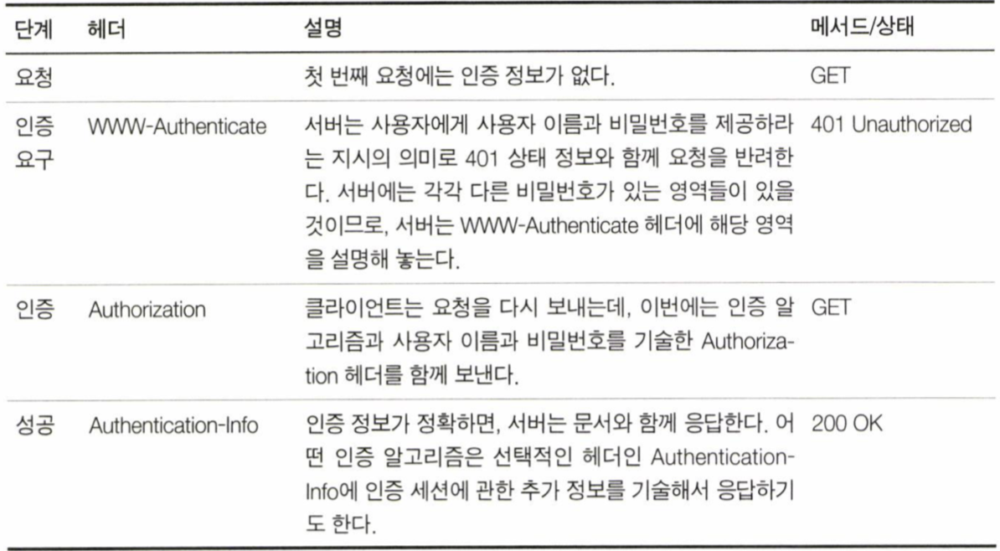

# 12장. 기본 인증

<br>

## 소개

<br>

권한이 없는 사용자가 볼 수 없는 공간이 필요하므로 서버는 사용자가 누구인지 식별을 할 수 있어야 한다.

HTTP는 자체적인 인증 관련 기능을 제공한다.

## 12.1 인증

- 인증의 기본 개념은 사용자가 누구인지 증명하는 것이다.

- 물론 완벽한 인증은 존재하지 않지만, 여러 데이터는 당신이 누구인지 판단하는데 도움이 된다.

<br>

### 12.1.1 HTTP의 인증요구/응답 프레임워크

<br>

<p align="center"></p>

<br>


- HTTP는 자체 인증요구/응답 프레임워크를 제공한다.

- 서버는 인증 요구를 하고, 클라이언트는 사용자의 인증 정보를 첨부해 다시 요청을 보낸다.

<br>

### 12.1.2 인증 프로토콜과 헤더

- HTTP는 필요에 따라 고쳐 쓸 수 있는 제어 헤더를 통해 여러 인증 프로토콜에 맞게 확장할 수 있는 프레임워크를 제공한다.

<br>

<p align="center"></p>

<br>

### 12.1.3 보안 영역

- HTTP가 각 리소스마다 다른 접근 조건을 다루는지 설명할 필요가 있다.

- 웹 서버는 기밀 문서를 보안 영역(realm)으로 나눈다. 
  
- 보안 영역은 저마다 다른 사용자 권한을 요구한다. 

<br>

<p align="center"></p>

<br>

```
HTTP/1.0 401 Unauthorized
WWW-Authenticate: Basic realm="Corporate Financials"

# 해당 예시는 Realm 파라미터를 함께 기술하여 회사 재무 영역에 접근하는 방법이다.
```

## 12.2 기본 인증

- 웹 서버는 클라이언트의 요청을 거부하고 ID/PW를 요구할 수 있다.
  
- 401 상태 코드와 함께 WWW-Authenticate 헤더에 스킴과 realm 을 기술해서 응답하여 인증 요구를 시작한다.

- 인증 요구를 받은 브라우저는 ID/PW를 입력할 수 있는 대화 상자를 열고, 브라우저는 ID/PW를 Authorization 요청 헤더 안에 암호화해서 서버로 다시 보낸다.

- 기본 인증 프로토콜은 Authentication-Info 헤더를 사용하지 않는다.

### 12.2.1 Base-64 ID/PW 인코딩

- HTTP 기본 인증은 사용자 이름과 비밀번호를 콜론으로 이어서 합치고 base-64 인코딩을 한다.

- base-64 인코딩은 8비트 바이트로 이루어져 있는 시퀀스를 6비트 덩어리의 시퀀스로 변환한다.
  
- 각 6비트 조각은 대부분 문자와 숫자로 이루어진 특별한 64개의 문자 중에서 선택된다.
  
- base-64 인코딩은 전송 중에 원본 문자열이 변질될 걱정이 없기에 국제 문자나 HTTP 헤더에서 사용할 수 없는 문자(큰 따옴표, 콜론 등)를 포함한 ID/PW를 보내야 할 때 유용하다.

<br>

### 12.2.3 프락시 인증

- 프락시 서버를 사용하면 접근 정책을 중앙 관리할 수 있어 프락시를 통한 사용자 인증을 사용하는 경우도 있다.

<br>

<p align="center"></p>

<br>

## 12.3 기본 인증의 보안 결함

- 기본 인증은 해당 요청이 탈취당했을 경우 누구나 쉽게 디코딩해서 인증 정보를 확인할 수 있다.
  
- 탈취당해도 원본을 확인할 수 없는 SSL, TLS 같은 암호화 채널을 사용하거나 다이제스트 인증 같은 프로토콜을 사용하는 것이 좋다.
  
- 탈취한 인증 정보를 직접 디코딩 할 수 없더라도 서버로 해당 문자열들 그대로 보내 인증에 성공할 수 있다.

- 기본 인증은 재전송 공격을 방지하기 위한 장치가 없다.
  
- 중간에 프락시와 같은 중개자에 의해 인증 헤더가 아닌 다른 부분을 수정하여 트랜잭션의 의도를 바꾸는 경우 정상적인 동작을 보장하지 않는다.
  
- 인증 정보를 요청하는 가짜로 위장한 서버에 대한 대책이 없다.

- 그렇기에 기본 인증은 우연한 사고를 예방하기 위한 1차적인 방어 수단 정도로 사용된다.