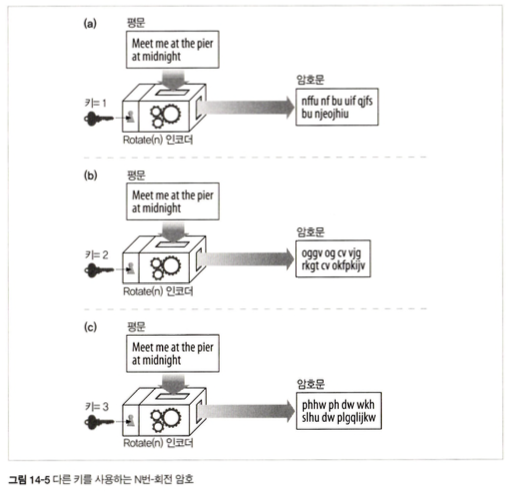
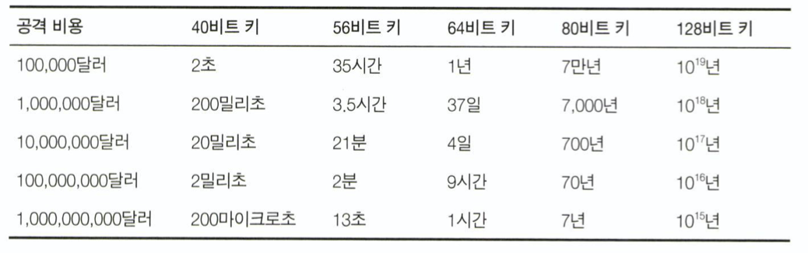
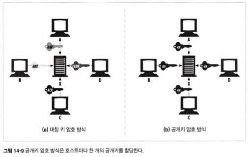
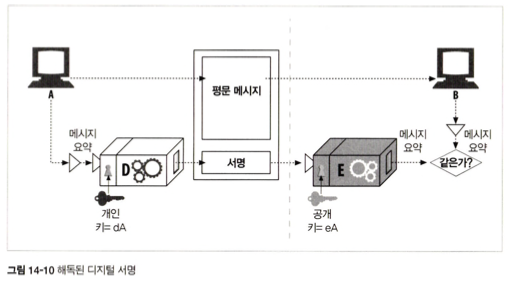
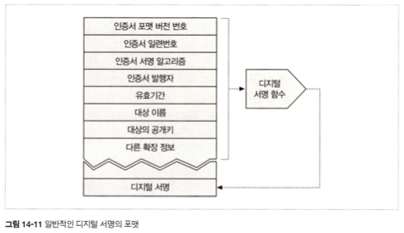
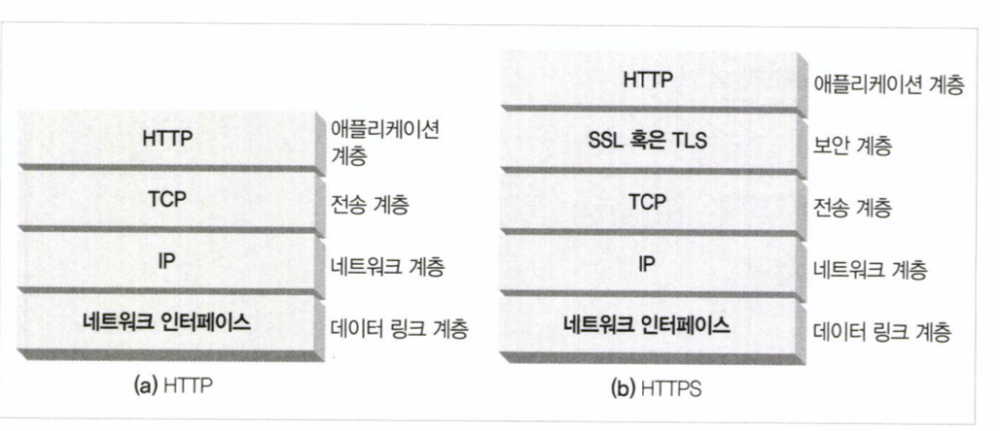
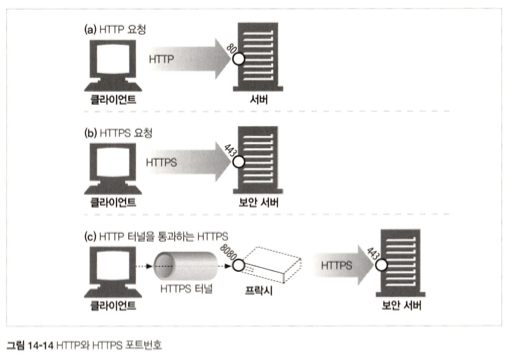
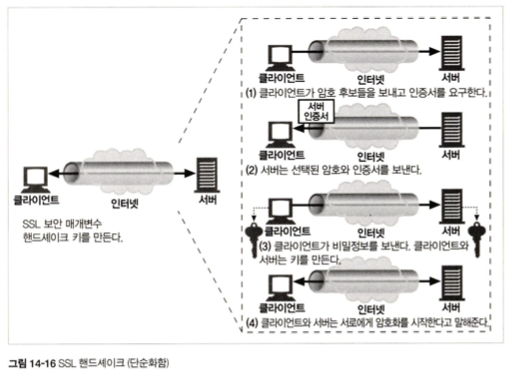
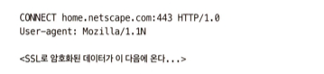
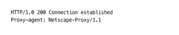

# 14장. 보안 HTTP

<br>

## 소개

<br>

디지털 암호화를 이용해 도청이나 위조로부터 HTTP 트랜잭션을 안전하게 보호하는 더 복잡하고 적극적인 기술을 배워보자.

## 14.1 HTTP를 안전하게 만들기

- 웹은 안전한 방식의 HTTP를 필요로 한다.

- 기본, 다이제스트 인증과 메시지 무결성은 대량 구매, 은행 업무, 보안 자료 접근 등을 위해서는 충분히 강력하지 않다.

- 보다 중요한 트랜잭션을 위해서는 HTTP와 디지털 암호화 기술을 결합해야 한다.

- HTTP 보안 버전 = 효율적 + 좋은 이식성 + 쉬운 관리 + 변화에 대한 적응력

- 해당 보안 기술을 제공해야 한다.

  - 서버 인증
      
      클라이언트는 진짜 서버와 통신함을 알아야 함

  - 클라이언트 인증
      
      서버는 진짜 클라이언트와 통신함을 알아야 함

  - 무결성
      
      데이터의 위조에 대해 안전

  - 암호화

      도청에 대한 보안

  - 효율

      알고리즘은 충분히 빨라야 함

  - 편재성

      모든 클라이언트와 서버에서 지원되어야 함

  - 관리상 확장성

      즉각적인 보안 통신을 할 수 있어야 함

  - 적응성

      최선의 보안 방법을 지원해야 함

  - 사회적 생존성

      사회 문화적, 정치적 요구를 만족 시켜야 함

<br>

### 14.1.1 HTTPS

- HTTPS는 HTTP의 하부에 전송 레벨 암호 보안 계층을 제공함으로써 동작한다.

- 이 보안 계층은 Secure Socket Layer(SSL) 혹은 Transport Layer Security(TLS)를 이용해 구현된다.

<br>

<p align="center"></p>

<br>

- 인코딩 및 디코딩 작업은 대부분 SSL 라이브러리 안에서 일어나기 때문에 프로토콜을 처리하는 로직을 크게 변경할 필요가 없다.

- 대부분의 경우 TCP 입/출력 호출을 SSL 호출로 대체하고 보안 정보를 설정하고 관리하기 위한 호출들을 추가하기만 하면 된다.

## 14.2 디지털 암호학

### 14.2.1 비밀 코드의 기술과 과학

- 암호법은 메시지를 암호화 하는 것 뿐만 아니라, 메시지의 변조를 방지하기 위해 사용할 수도 있다.

<br>

### 14.2.2 암호(cipher)

- 암호는 메시지를 인코딩하고, 이후 비밀 메시지를 디코딩하는 방법이다.

- 암호 매개변수를 키라고 부르며, 디코딩 과정을 동작시키려면 올바른 키를 암호 기계에 입력할 필요가 있다.

- 오늘날 대부분의 암호 알고리즘은 키를 사용한다.

<br>

<p align="center"></p>

<br>

## 14.3 대칭키 암호법

- 대칭키 암호법은 인코딩할 때 사용하는 키와 디코딩할 때 사용하는 키가 같다.

- 발송자와 수신자가 똑같은 비밀키를 공유한다.

- 잘 알려진 대칭키 암호 알고리즘으로는 DES, RC2, RC4 ...

### 14.3.1 키 길이와 열거 공격

- 무차별로 모든 키 값을 대입해보는 공격을 열거 공격이라고 한다.

- 128비트 키를 열거 공격으로 알아내기 위해서는 엄청나게 오랜 시간이 소요된다.

<br>

<p align="center"></p>

<br>


<br>

### 14.3.2 공유키 발급하기

- 대칭키 암호의 단점 중 하나는 발송자와 수신자가 서로 대화하려면 둘 다 공유키를 가져야 한다는 것이다.

<br>

## 14.4 공개키 암호법

- 공개키 암호법은 두개의 비대칭 키를 사용한다. 인코딩 키는 모두에게 공개되어 있다.(그래서 공개키)

- 모든 사람이 X에게 보내는 메시지를 같은 키로 인코딩 할 수 있지만, X를 제외한 누구도 그 메시지를 디코딩할 수 없다.

<br>

<p align="center"></p>

<br>

- 공개키 암호화 기술은 보안 프로토콜을 모든 컴퓨터 사용자에게 적용하는 것을 가능하게 했다.

<br>

### 14.4.1 RSA

- 공개키, 암호문의 일부, 메시지와 그것을 암호화한 암호문이 주어져도 개인 키를 계산할 수 없다는 것을 확신 시켜주는 공개키 암호 체계 중 하나는 RSA 알고리즘이다.

<br>

### 14.4.2 혼성 암호 체계와 세션 키

- 공개키 암호는 계산이 느리다. 그래서 실제로는 대칭과 비대칭 방식을 섞은 것이 쓰인다.

- 예를 들어, 노드들 사이에 안전한 의사 소통 채널을 만들 때에는 공개 키 암호를 사용하고, 이렇게 만들어진 안전한 채널을 통해 임시의 무작위 대칭키를 생성하고 교환하여 이후의 나머지 데이터를 암호화 할 때는 빠른 대칭 키를 사용한다.

## 14.5 디지털 서명

- 암호 체계는 누가 메시지를 썼는지, 위조되지 않았는지를 증명하는 데 이용될 수 있다.

### 14.5.1 서명은 암호 체크섬이다

- 디지털 서명은 메시지에 붙어있는 특별한 암호 체크섬이다.

- 체크섬이란 나열된 데이터를 더하여 체크섬 숫자를 얻고, 정해진 비트수의 모듈라로 정해진 비트수로 재구성 한다.

- 디지털 서명의 두가지 이점

    - 서명은 메시지를 작성한 저자가 누군지 알려준다.
  
        저자는 저자의 극비 개인 키를 갖고 있기 때문에, 오직 저자만이 이 체크섬을 계산할 수 있다. 그래서 체크섬은 저자의 개인 서명(signature)처럼 동작한다.

    - 서명은 메시지 위조를 방지한다.
 
        송신 중인 메시지를 수정하면 체크섬은 더이상 맞지 않는다. 또 체크섬은 저자의 비밀 개인 키와 관련되어 침입자는 위조된 메시지에 대해 올바른 체크섬을 날조할 수 없다.
    
<br>

- 디지털 서명은 보통 비대칭 공개키에 의해 생성된다.
  
- 개인 키는 오직 소유자만이 알고 있기에 개인키는 지문처럼 사용된다.

<br>

<p align="center"></p>

<br>

1. 노드 A는 가변 길이 메시지를 정제하여 고정된 길이의 요약(digest)로 만듦
   
2. 노드 A는 그 요약에, 사용자의 개인 키를 매개변수로 하는 '서명' 함수를 적용해서 서명과 메시지를 노드 B에 전송

3. 메시지를 받은 노드 B는 공개키를 이용한 역함수를 적용하여 서명을 검사 

4. 이 결과가 노드 B가 갖고 있는 버전의 요약과 일치하지 않는다면, 메시지는 송신 중에 위조되었거나 발송자가 노드 A가 보낸 메시지가 아닌 것.


## 14.6 디지털 인증서

- 디지털 인증서는 신뢰할 수 있는 기관으로부터 보증받은 사용자나 회사에 대한 정보를 담고 있다.

### 14.6.1 인증서의 내부

- 인증서는 다음 내용을 담고 있다.

    대상의 이름(사람, 서버, 조직 등)

    유효 기간

    인증서 발급자(누가 이 인증서를 보증하는지)
    
    인증서 발급자의 디지털 서명

- 추가적으로 보통 대상의 공개키도 담고 있다. 누구나 디지털 인증서를 만들 수 있지만, 그 인증서를 개인 키로 서명할 수 있는 서명 권한을 얻을 수 있는 건 아니다.

<br>

<p align="center"></p>

<br>

### 14.6.2 X.509 v3 인증서

- 디지털 인증서에 대한 단일 표준이 없지만 X.509라 부르는 표준화된 서식에 저장하고 있다.

<br>

### 14.6.3 서버 인증을 위해 인증서 사용하기

1. 사용자가 HTTPS를 통한 안전한 웹 트랜잭션을 시작할 때, 최신 브라우저는 자동으로 접속한 서버에서 디지털 인증서를 가져온다.

2. 만약 서버가 인증서를 갖고 있지 않다면, 보안 커넥션은 실패한다.
 
- <서버 인증서가 포함하는 필드>

    웹 사이트의 이름과 호스트 명

    웹 사이트의 공개키

    서명 기관의 이름

    서명 기관의 서명

3. 브라우저가 인증서를 받으면, 서명 기관을 검사한다.
  
4. 만약 그 기관이 공공이 신뢰할만한 서명 기관이라면 브라우저는 그것의 공개키를 이미 알고 있을 것이다.(보통 브라우저에 여러 서명 기관의 인증서가 미리 설치된 상태)

5. 만약 서명 기관이 모르는 곳이라면, 서명 기관을 신뢰하는지 확인하기 위한 대화상자를 보여준다.

<br>

## 14.7 HTTPS의 세부사항

- HTTPS는 HTTP 프로토콜에 대칭, 비대칭 인증서 기반 암호 기법의 강력한 집합을 결합한 것이다.

### 14.7.1 HTTPS 개요

<br>

<p align="center"></p>

<br>

- 암호화되지 않은 HTTP 메시지를 TCP를 통해 인터넷 곳곳으로 보내는 대신에 HTTPS는 먼저 그것을 암호화하는 보안 계층으로 보낸다.

<br>

### 14.7.2 HTTPS 스킴

<br>

<p align="center"></p>

<br>

- HTTP가 아닌 HTTPS로 연결한다는 것을 알리기 위해 기본적으로 443 포트를 사용한다.

- SSL 트래픽은 바이너리 프로토콜이기 때문에, 바이너리 SSL 트래픽을 전송하여 HTTP와는 완전히 다르다.

```
#바이너리 프로토콜이란?

HTTP는 텍스트 기반 프로토콜입니다. 즉, HTTP 메시지는 문자열로 구성되어 있습니다. 반면에 SSL은 바이너리 프로토콜입니다. 즉, SSL 메시지는 바이너리 데이터로 구성되어 있습니다.

바이너리 데이터는 텍스트와 달리 숫자와 기호의 집합입니다. 따라서 바이너리 데이터를 텍스트 기반 프로토콜로 전송하려면 먼저 텍스트로 변환해야 합니다. 이를 인코딩이라고 합니다.

SSL 트래픽은 바이너리 데이터이기 때문에, 바이너리 SSL 트래픽을 전송하기 위해서는 인코딩을 하지 않고 그대로 전송해야 합니다. 이를 바이너리 프로토콜이라고 합니다.

쉽게 설명하자면, HTTP는 편지를 쓰는 것과 비슷합니다. 편지는 문자열로 구성되며, 봉투에 넣어서 우체통에 넣으면 됩니다. 반면에 SSL은 그림을 그리는 것과 비슷합니다. 그림은 숫자와 기호의 집합으로 구성되며, 봉투에 넣어서 우체통에 넣으면 그림이 깨질 수 있습니다. 따라서 그림은 그대로 전송해야 합니다.

SSL 트래픽을 바이너리 프로토콜로 전송하는 이유는 다음과 같습니다.

보안: 바이너리 데이터는 텍스트보다 해독하기 어렵습니다. 따라서 SSL 트래픽을 바이너리 프로토콜로 전송하면 보안을 강화할 수 있습니다.
성능: 바이너리 데이터는 텍스트보다 전송 속도가 빠릅니다. 따라서 SSL 트래픽을 바이너리 프로토콜로 전송하면 성능을 향상시킬 수 있습니다.
SSL 트래픽은 HTTPS에서 사용됩니다. HTTPS는 웹 브라우저와 웹 서버 간의 통신을 보호하기 위해 사용되는 프로토콜입니다. HTTPS를 사용하면 웹 브라우저에서 입력한 데이터가 해킹으로부터 안전하게 보호됩니다.
```


<br>

### 14.7.3 보안 전송 셋업

<br>

<p align="center"></p>

<br>

### 14.7.4 SSL 핸드셰이크

<br>

<p align="center"></p>

<br>

- 핸드셰이크에서는 다음과 같은 일이 일어난다

    프로토콜 버전 번호 교환

    양쪽이 알고 있는 암호 선택
    
    양쪽의 신원을 인증
    
    채널을 암호화하기 위한 임시 세션 키 생성

<br>

### 14.7.5 서버 인증서

- 보안 HTTPS 트랜잭션은 항상 서버 인증서를 요구한다.

- 그 조직이 맞는지, 얼마나 신뢰할 수 있는지 확인하기 위해서이다.

<br>

### 14.7.6 사이트 인증서 검사

- 웹 서버 인증서 검사를 위한 알고리즘의 수행 단계

    - 날짜 검사
    
        유효한지? 만료되었거나 활성화되지 않았는지?
    
    - 서명자 신뢰도 검사
    
        인증서에도 수준이 있다. 목적에 부합하는 신뢰도를 갖는지 검사한다.
    
    - 서명 검사
    
        공개키로 인코딩해서 비교한다.
    
    - 사이트 신원 검사
    
        호스트의 도메인이 인증서에 적힌 도메인과 같은지 검사한다.
        다른 이가 인증서를 복사해서 사용하는 것을 방지한다.

<br>

### 14.7.7 가상 호스팅과 인증서
 
- 가상 호스팅을 사용하는 경우 (와일드카드를 사용한) 도메인이 일치하지 않을 수 있다.

- 원서버가 보안 트랜잭션을 요구하는 유저들을 모두 리다이렉트 시키는 방법을 사용할 수 있다.

<br>

## 14.8 진짜 HTTPS 클라이언트

- OpenSSL

    OpenSSL은 SSL과 TLS의 가장 인기 있는 오픈 소스 구현이다.

<br>

## 14.9 프락시를 통한 보안 트래픽 터널링

- 많은 회사가 기업 네트워크와 공공 인터넷을 잇는 경계에 보안을 위한 프락시를 설치한다.

- 프락시는 방화벽 라우터가 HTTP 트래픽의 교환을 허락한 유일한 장치이며, 바이러스 검사나 기타 콘텐츠 제어를 수행할 것이다.

<br>

- HTTPS를 사용하게 되면 TCP 레이어에 가기 전에 HTTP 메시지가 암호화 된다.

- 프락시들이 받은 트래픽은 HTTPS 트래픽으로, HTTP 헤더를 읽을 수가 없게 된다.

- 프락시는 어디에 요청을 보내야 하는가?
  
- HTTPS가 프록시와도 잘 동작할 수 있게 하기 위해, 클라이언트가 프록시에게 어디에 접속하려고 하는지 말해주는 방법을 약간 수정해야 한다.

<br>
  
- 인기 있는 기법 중 하나가 HTTPS SSL 터널링 프로토콜이다.

- `HTTPS SSL 터널링 프로토콜`

    클라이언트는 먼저 프록시에게 자신이 연결하고자 하는 안전한 호스트와 포트를 말해줌
    
    클라이언트는 이 내용을 프록시가 읽을 수 있도록 암호화가 시작되기 전의 평문으로 말해줌
    
    이를 위해 CONNECT 메서드를 이용해서 평문으로 된 endpoint 정보를 전송하고 이후 클라이언트와 서버 사이에 데이터가 direct로 오갈 수 있는 터널을 만듦

    <br>

    <p align="center"></p>

    <p align="center"></p>

    <br>