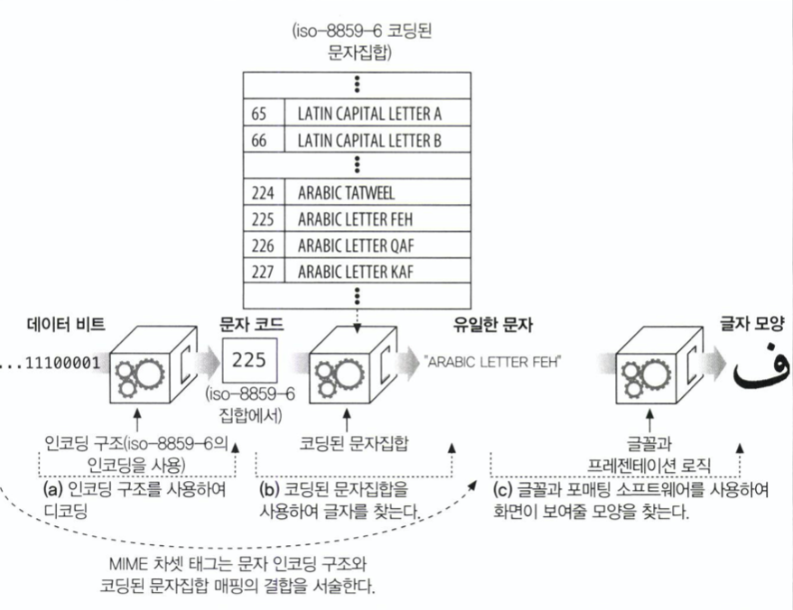

# 16장. 국제화
 

## 소개

 

HTTP는 여러 언어와 문자로 된 국제 문서들의 처리 및 전송을 지원해야 한다.

HTTP 애플리케이션은 여러 언어의 문자로 텍스트를 보여주고 요청하기 위해 문자집합 인코딩을 사용한다.

## 16.1 국제적인 콘텐츠를 다루기 위해 필요한 HTTP 지원

- HTTP 메세지는 어떤 콘텐츠든 담을 수 있다.

- HTTP의 엔터티 본문은 그저 비트 덩어리이다.

- 비트 덩어리를 콘텐츠로 만들기 위한 트랜스코딩 정보를 제공하는 방법이 필요하다.

## 16.2 문자집합과 HTTP

- 문자집합과 인코딩은 어떻게 동작하는가
  
 

 

- 비트들을 코딩된 문자집합의 특정 문자로 변환
  
    1. 비트 -> 문자 코드 
    
    2. 문자 코드 -> 문자집합의 문자 코드와 대응하는 문자

## 16.3 국제화된 URI

- URL는 국제화를 별로 지원하지 않으며 US-ASCII의 부분집합으로 구성되어 있다 정도이다.

- 리소스 식별자의 가독성과 공유 가능성의 보장을 위해 ASCII 문자들의 제한된 집합으로 이루어지는 것이 좋다.