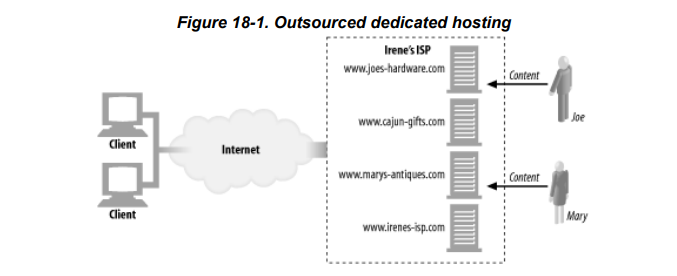
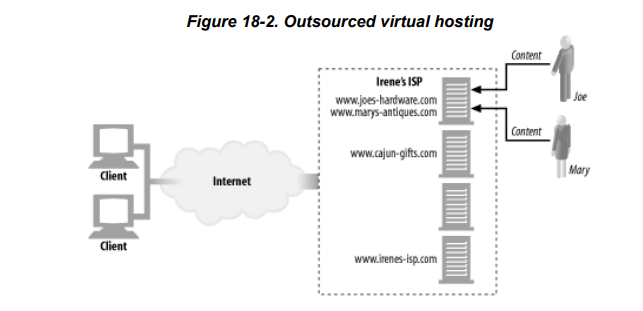
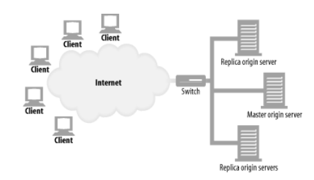
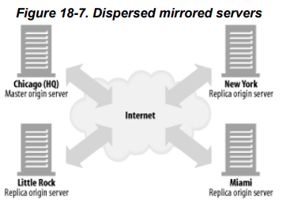
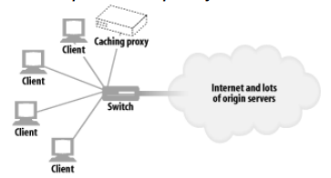

# 18장. 웹 호스팅

 

## 소개

 

다양한 종류의 리소스를 웹 사이트에 배포하거나, 적절한 가격에 좋은 성능을 가진 웹 서버에 배치하는 것은 중요하다.

`웹 호스팅이란 콘텐츠 리소스를 저장, 중개, 관리하는 일`이다.

호스팅은 웹 서버의 가장 중요한 기능 중 하나다.

## 호스팅 서비스

웹 서버를 전문적으로 관리하는 서비스

### 전용 호스팅

 

### 가상 호스팅

 

 

- 가상 호스팅은 컴퓨터 한 대를 여러 고객이 공유하게 해서 웹 호스팅 서비스를 제공하는 것이다.

## 안정적인 웹 사이트 만들기

장애의 케이스

- 서버 다운

- 트래픽 폭증 (갑작스런 트래픽으로 처리해야 할 일이 많아진 서버 컴퓨터가 느려지거나 멈춤)

- 네트워크 장애 및 손실

## 해결 방법

### 미러링 서버 팜

- 서버 팜은 서로 대신할 수 있고 식별할 수 있게 설정된 웹 서버들의 집합이다.

- 서버 팜의 서버에 있는 콘텐츠들은 한 곳에 문제가 생기면 다른 한 곳에서 대신 전달할 수 있게 미러링할 수 있다.

 

 

- 스위치가 서버인 척 하면서 요청을 분산시킨다.

- 마스터 원 서버는 복제된 서버들에게 변경된 리소스를 보낸다.

 

### 분산 미러링 서버

 

 

- 마스터 서버가 각 지역의 복제된 서버에 리소스를 보내면서 리디렉션 시키거나(HTTP 리디렉션) 리디렉션 되도록 구성(DNS 리디렉션)한다.

 

### 컨텐츠 분산 네트워크(CDN)

- 특정 컨텐츠를 분산할 목적으로 구성하는 네트워크

- 리버스 프록시 (대리 캐시) 구성
    
    - 위에서 다룬 미러링 서버 팜이나 분산 미러링 서버에서의 원 서버에 가기 전에 리버스 프록시를 거치도록 구성한다.
    
    - 리버스 프록시는 전체 리소스를 복제하는 복제 서버와는 다르게 클라이언트 요청에 따라 선택적으로 복제(캐싱)된 컨텐츠를 반환해준다.
    
    - 사용자가 요청하기 전에 미리 가져오는 프록시 서버도 있다.
    
    - 원 서버는 이 프록시에 리소스를 동기화할 의무는 없다.

 

- 프록시 캐시 구성

 

 

- 스위치가 클라이언트 요청을 가로채 프락시로 보내기도 한다.
