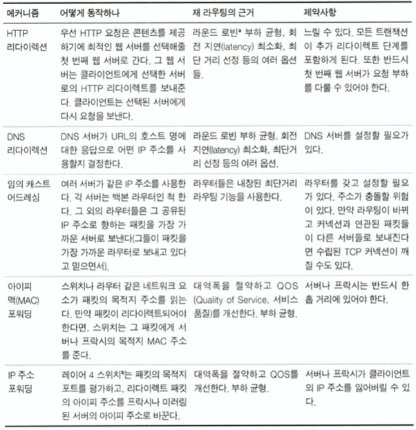
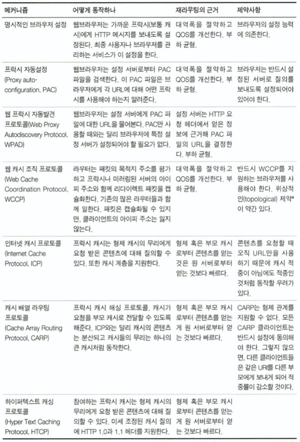
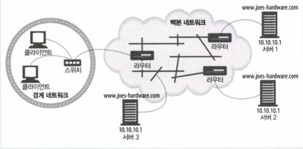
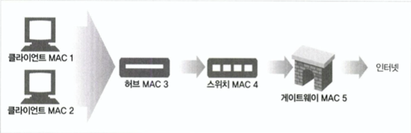

# 20장. 리다이렉션과 부하 균형

<br>

## 소개

<br>

리다이렉션 기술이란 HTTP 메시지의 최종 목적지를 결정하는 네트워크 도구, 기법, 프로토콜을 말한다.

## 왜 리다이렉트인가?

- HTTP 애플리케이션의 요구 사항

    1. 신뢰할 수 있는 HTTP 트랜잭션의 수행
    2. 지연 최소화
    3. 네트워크 대역폭 절약

- 해당 요구 사항을 해결하기 위해

    1. 여러 장소에 배포함으로써 신뢰성 개선(한 곳에서 실패한 경우 다른 곳을 이용)
    2. 여러 장소에 배포함으로써 가까운 리소스에 접근
    3. 요청이 분산되어 네트워크 혼잡을 줄임
   
- 리다이렉션은 최적의 분산된 콘텐츠를 찾는 것을 도와주는 기법의 집합이다.

- 리다이렉션과 부하 균형은 공존하는 개념이다.
  
## 리다이렉트 할 곳

- 서버, 프락시, 캐시, 게이트웨이는 클라이언트 입장에선 모두 서버이며 서버의 특성을 갖고 있기 때문에 리다이렉션 기법이 동작한다.

<br>

- 웹 서버는 IP 별로 요청을 다룬다.

- 이것은 같은 URL에 대해 여러 곳에서 온 요청들을 최적의 웹 서버로 보내겠다는 것을 의미한다.(가장 가까운 것, 부하가 가장 적은 것 등)

<br>

- 프락시는 프로토콜별로 요청을 다룬다.
  
- 프락시의 리다이렉트는 주 진입로의 트래픽을 근처에 있는 지름길로 빨아들이는 것과 비슷하다.

## 리다이렉션 프로토콜의 개요

- 리다이렉션의 목표는 HTTP 메시지를 가용한 웹 서버로 가급적 빨리 보내는 것이다.

- HTTP 애플리케이션과 라우팅 장치에 영향을 받는다.
  
- 브라우저가 메세지를 프락시 서버로 보내도록 설정이 가능하다.
 
- DNS resolver는 클라이언트의 위치에 따라 다른 IP 주소를 내려줄 수 있다.
  
- 스위치 또는 라우터 장비에서 TCP/IP 주소를 기반으로 라우팅할 수 있다.

- 웹 서버는 HTTP 리다이렉트를 사용해 요청을 다른 웹 서버로 가도록 할 수 있다.

<br>

- 일반 리다이렉션 방법
  
<br>

<p align="center"></p>

<br>


- 프락시 서버 리다이렉션 방법

<br>

<p align="center"></p>

<br>

## 일반적인 리다이렉션 방법

### HTTP 리다이렉션

- 리다이렉팅 서버가 콘텐츠 서버의 부하나 거리를 고려하여 최선의 서버로 요청을 리다이렉트한다.

- 특징
    
    클라이언트의 IP 주소에 기반한 결정

- 단점

    리다이렉팅 서버의 부하가 커질 수 있음
    
    두번의 왕복이필요하기 때문에 지연이 커짐
    
    리다이렉트 서버가 고장나면 사이트도 고장남

### DNS 리다이렉션

- DNS는 하나의 도메인에 여러 IP 주소가 등록되는 것을 허용한다.

- 웹 서버들을 모니터링하는 DNS 분석자가 존재한다.

- DNS 결정 알고리즘

    - 라운드 로빈
    
        웹 서버 팜 전체에 대한 부하 균형 유지에 초점

    - 부하 균형 알고리즘

        웹 서버의 부하를 추적하여 부하가 가장 낮은 서버를 목록의 첫 번째에 위치시킴

    - 근접 라우팅 알고리즘
    
        사용자와 가장 가까운 위치의 웹 서버로 라우팅

    - 결함 마스킹 알고리즘
  
        네트워크 상태를 모니터링하여 장애 지점을 피해 라우팅

    
### 임의 캐스트 어드레싱

- 백본 라우터의 최단거리 라우팅에 의존하는 방법

- 이 방법이 동작하는 방식

    각 웹 서버에게 자신을 인접한 백본 라우터를 향하는 라우터라고 광고하는 것

```
백본 라우터란?

백본 라우터는 광역 네트워크(WAN)의 핵심 부분을 형성하는 고성능 라우터입니다. 

백본 라우터는 여러 네트워크를 연결하고, 데이터를 효율적으로 전송하며, 네트워크의 안정성을 유지하는 역할을 합니다. 

 기업에서는 사내망과 인터넷을 연결하는 데 백본 라우터를 사용합니다. 기관에서는 내부망과 외부망을 연결하는 데 백본 라우터를 사용합니다. 정부에서는 전국의 각 기관을 연결하는 데 백본 라우터를 사용합니다.

```

<br>

<p align="center"></p>

<br>

### 아이피 맥 포워딩

- 레이어-4 스위치를 사용해 특정 IP 주소와 포트번호에 대한 요청을 특정 MAC 장비로 포워딩

<br>

<p align="center"></p>

<br>

###  아이피 주소 포워딩

- 레이어-4 스위치를 사용해 특정 IP 주소와 포트번호에 대해 목적지 IP 주소의 변경에 따라 라우팅


### 네트워크 구성요소 제어 프로토콜

- 네트워크 구성요소들과 서버 구성요소들의 통신 수단

